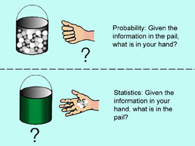

```{r setup, include=FALSE}
knitr::opts_chunk$set(echo = TRUE)
```

## How to get set up for this workshop

### Our virtual space:

[https://todaysmeet.com/wwc_stats](https://todaysmeet.com/wwc_stats)

### Getting this document on your computer:

1. Go to the GitHub repository here: [https://github.com/davidklaing/data_science_workshops](https://github.com/davidklaing/data_science_workshops)
2. Click the green button on the right that says "Clone or download".
3. Click "Download ZIP". (If you're proficient with git, feel free to clone the repository.)
4. Create a folder on your computer to store your work, and store your ZIP file there.
5. Double-click your ZIP file to unzip it and get all the code.

### Getting R and Rstudio

1. Download and install R from here: [http://cran.stat.sfu.ca/](http://cran.stat.sfu.ca/).
2. Download and install RStudio Desktop (Open Source Edition) from here: [https://www.rstudio.com/products/rstudio/#Desktop](https://www.rstudio.com/products/rstudio/#Desktop).

### Getting ready to play!

1. In RStudio, open `applied_statistics.Rmd`, a file in `YOUR_FOLDER/data_science_workshops/applied_statistics/src/`. (That's this file!)
2. In the code snippet below, remove the hashtags from both lines, and click the green "play" button on the right to install `dplyr`, `ggplot2`, and `titanic`, the three packages you'll need for the workshop.

```{r}
#install.packages("dplyr")
#install.packages("ggplot2")
#install.packages("titanic")

library(dplyr)
library(ggplot2)
library(titanic)
```

### Having installation problems?

Option 1: Ask for help! We have volunteers who can help troubleshoot.

Option 2a: Find a partner and follow along together — most of the exercises can be done collaboratively. Your installation problem is almost certainly solvable — we just might not have time today.

Option 2b: Use [this datacamp light](https://cdn.datacamp.com/dcl/standalone-example.html) page to write and execute code in your browser. (A couple caveats: doesn't come with the titanic data, and might end up distracting you from the lesson. If this is your first time programming, I recommend option 2a.)

## Warm-up exercise — in pairs

The code snippet below reads in a CSV file with just one column — a vector of numbers. Recalling what you may have learned in the previous workshop, try visualizing these numbers to get a sense of their distribution. To consider:

- What type(s) of plots might be appropriate in this case? 
- If you had to summarize the sample numerically, what would you do?
- Say we draw one more number from the same process that generated this sample — what would you predict would be its value?
- Say we draw 100,000 more numbers from the same process that generated this sample — what would you predict about their values?

```{r}
sample_df <- read.csv("../data/sample_df.csv")
sample_df
# Write your code here!
hist(sample_df$sample_data)

ggplot(
  data = sample_df,
  mapping = aes(x = sample_data)
) +
  geom_histogram(bins = 5)

ggplot(
  data = sample_df
) +
  geom_boxplot(mapping = aes(y = sample_data, x = ""))

ggplot(
  data = sample_df
) +
  geom_density(aes(x = sample_data))
```

## The most common statistical tasks in data science

1. Understanding the distribution of a sample. (exploratory data analysis)
2. Summarizing information about a sample. (description)
3. Predicting the future. (prediction)
4. Characterizing the unknown. (inference)

## Understanding the distribution of a sample

Key concepts:

- Histograms, density plots, boxplots, bar plots

Useful R functions:

- `ggplot()`, `geom_histogram()`, `geom_density()`, `geom_boxplot()` `geom_bar()`

### Let's try!

Make two plots from the `titanic_train` dataset, from the `titanic` package: one of the `Fare` variable, and one of the `Age` variable. What can you say about the shapes of these distributions?

```{r}
# Plot of Fare
titanic_train %>%
  ggplot(mapping = aes(x = Fare)) +
  geom_histogram(bins=20)

# Plot of Age
titanic_train %>%
  ggplot(mapping = aes(x = Age)) +
  geom_histogram(bins = 20)
```

## Summarizing information about a sample

Key concepts:

- Measures of central tendency (location) — mean, median, (less commonly) mode
- Measures of spread — standard deviation, variance, mean/median absolute deviation, maximum, minimum, percentiles

Useful R functions:

- `summarize()` `summary()`, `mean()`, `median()`, `sd()`, `var()`, `mad()`, `max()`, `min()`, `quantile()`

### Let's try!

Compute the mean and the median of the `Fare` variable in `titanic_train`. Which seems like a better description of the central tendency of the distribution?

- Bonus challenge: use `geom_vline()` or `geom_hline()` to add both metrics to the plot you created above!

```{r}
# Compute the mean and median of the fare paid by passengers of the titanic
mean_of_fare <- mean(titanic_train$Fare)
median_of_fare <- median(titanic_train$Fare)
central_tendency_stats <- titanic_train %>% 
  summarise(
    mean_of_age = mean(Age, na.rm = TRUE),
    median_of_age = median(Age, na.rm = TRUE)
  )

titanic_train %>%
  ggplot(mapping = aes(x = Age)) +
  geom_histogram(bins = 20) +
  geom_vline(
    data = central_tendency_stats,
    aes(xintercept = mean_of_age),
    color = "red"
  ) +
  geom_vline(
    data = central_tendency_stats,
    aes(xintercept = median_of_age),
    color = "blue"
  )
```

Now do the same for the `Age` variable. Which seems like a better description of the central tendency of the distribution?

```{r}
# Compute the mean and median age of passengers of the titanic
```

Compare the various measures of spread (standard deviation, variance, median absolute deviation) on the Fare variable. Which one seems most useful, descriptively? (Try to keep track of the units that each measure is expressed in.)

```{r}
# Compute the standard deviation of Fare

# Compute the variance of Fare

# Compute the median absolute deviation of Fare

titanic_train %>% 
  summarise(
    sd_of_fare = sd(Fare),
    var_of_fare = var(Fare),
    mad_of_fare = mad(Fare)
  )
```

## Predicting the future

Key concepts:

- Expected value, error minimization

Useful R functions:

- `mean()`

...more to come next month, when we discuss machine learning!

Challenge: compute the mean of Age in `titanic_train`, and then use that to predict the value of `Age` in `titanic_test` — add a prediction column using `mutate()`. How would you quantify the quality of your predictions?

```{r}
# Compute the mean of Age in titanic_train
mean_of_age <- mean(titanic_train$Age, na.rm = T)

# Use `mutate()` to add the mean of Age in titanic_train to a new column in titanic_test
test_mutated <- titanic_test %>% 
  mutate(
    age_prediction = mean_of_age
  ) %>% 
  select(Age, age_prediction)

# In titanic_test, you should now have a column called `Age` and a column called `predicted_age` (or something like it). Try to think of a way to report back on how good your predictions were!
test_mutated %>% 
  mutate(prediction_error = age_prediction - Age) %>% 
  summarize(mean(abs(prediction_error), na.rm = T))
```

## Characterizing the unknown (a.k.a. *inference*)



Image by MIT OpenCourseWare. Based on Gilbert, Norma. Statistics. Philadelphia, PA: W. B. Saunders Co., 1976. ISBN: 072164127X.

Questions to check your understanding:

- I flip a coin 100 times and find that it lands heads 53 times. I want to know whether this is a fair coin. Am I doing probability or statistics?
- I'm counting cards at a blackjack table in a casino. Am I doing probability or statistics? 

Key concepts:

- Sample, population, probability, hypothesis test

A quick demonstration: does the original sample (at the beginning of the workshop) provide evidence that it was drawn from a distribution with a mean of greater than zero?

```{r}
original_mean <- mean(sample_df$sample_data)
original_sd <- sd(sample_df$sample_data)

sample_means <- c()
sample_mean_tests <- c()

for (i in 1:10000) {
  new_sample <- rnorm(50, 0, original_sd)
  new_sample_mean <- mean(new_sample)
  sample_means <- append(sample_means, new_sample_mean)
  
  sample_mean_test <- new_sample_mean >= original_mean
  sample_mean_tests <- append(sample_mean_tests, sample_mean_test)
}

mean(sample_mean_tests)
```


