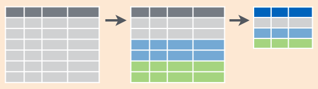
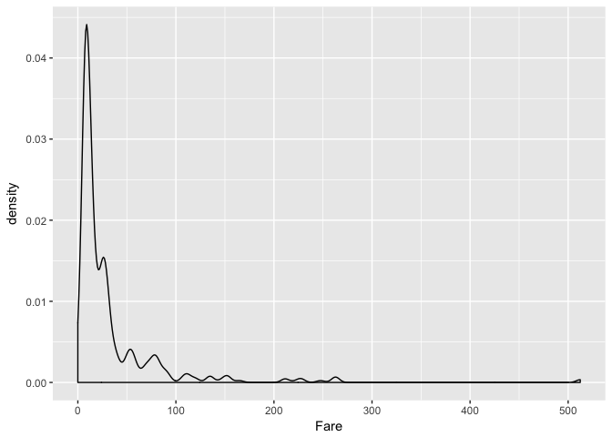
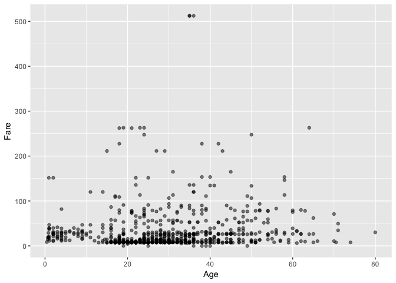
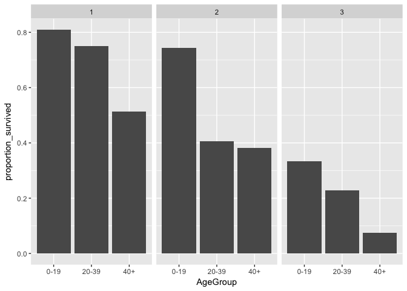
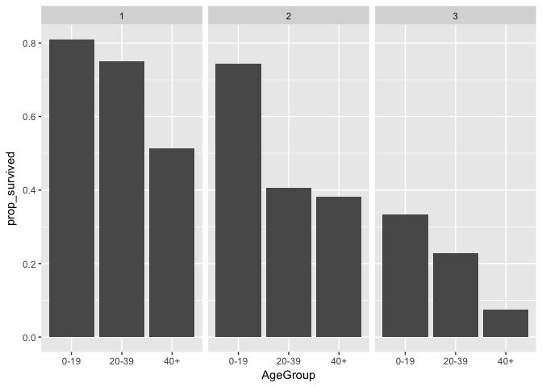

Data Wrangling in R - Workshop
================

How to get set up for this workshop
-----------------------------------

### Getting this document on your computer:

1.  Go to the GitHub repository here: <https://github.com/davidklaing/data_science_workshops>
2.  Click the green button on the right that says "Clone or download".
3.  Click "Download ZIP". (If you're proficient with git, feel free to clone the repository.)
4.  Create a folder on your computer to store your work, and store your ZIP file there.
5.  Double-click your ZIP file to unzip it and get all the code.

### Getting R and Rstudio

1.  Download and install R from here: <http://cran.stat.sfu.ca/>.
2.  Download and install RStudio Desktop (Open Source Edition) from here: <https://www.rstudio.com/products/rstudio/#Desktop>.

### Getting ready to play!

1.  In RStudio, open `data_wrangling_workshop.Rmd`, a file in `YOUR_FOLDER/data_science_workshops/data_wrangling`. (That's this file!)
2.  In the code snippet below, remove the hashtags from both lines, and click the green "play" button on the right to install `dplyr`, `ggplot2`, and `titanic`, the three packages you'll need for the workshop.

``` r
#install.packages("dplyr")
#install.packages("ggplot2")
#install.packages("titanic")
```

Ready to rock!!!
----------------

### What is data wrangling, and why would you want to learn how to do it?

Data wrangling is the process of subsetting, reshaping, summarizing, and editing a dataset so that you can ask new questions of it.

Today, we're going to be working just with tabular data — arranged in rows and columns — and we're going to learn how to use five functions from `dplyr`. (The name comes from "dataframe" and "plier" — it's meant to be evocative.) These are the five functions:

-   `select()`: get a subset of columns
-   `filter()`: get a subset of rows
-   `mutate()`: create a new column
-   `group_by()`: define groups according to the values in one or more columns
-   `summarise()`: reduce many rows down to a single value of interest.

### Rmarkdown in Rstudio: where the heck are we?

-   RStudio is an Interactive Development Environment (or IDE) — a desktop application for writing code.
-   Rmarkdown, the file format we're working in, allows us to write and execute code snippets, while also writing [markdown](https://github.com/adam-p/markdown-here/wiki/Markdown-Cheatsheet), a plain text format that allows for simple rendering of headings, bold, italics, hyperlinks, etc.
-   Analogy: Rstudio is to Rmarkdown as Microsoft Word is to .docx.

Quick tip for writing and executing code in RStudio: to execute a line of code, move your cursor to that line and then type `Ctrl+Enter`. For example:

``` r
# Move your cursor to the line below, and type Ctrl-Enter.
print("hello woRld!")
```

    ## [1] "hello woRld!"

First we'll load our packages, using the `library()` function:

``` r
library(dplyr)
```

    ## Warning: package 'dplyr' was built under R version 3.3.2

    ## 
    ## Attaching package: 'dplyr'

    ## The following objects are masked from 'package:stats':
    ## 
    ##     filter, lag

    ## The following objects are masked from 'package:base':
    ## 
    ##     intersect, setdiff, setequal, union

``` r
library(ggplot2)
library(titanic)
```

The `titanic` package has data about all the passengers of the Titanic. The two main datasets you can inspect are called `titanic_train` and `titanic_test` — the difference doesn't matter for now, but we'll talk about that when we get to the machine learning workshops later in the summer. Let's take a look at the first six rows of `titanic_train`, using the `head()` function:

``` r
head(titanic_train)
```

    ##   PassengerId Survived Pclass
    ## 1           1        0      3
    ## 2           2        1      1
    ## 3           3        1      3
    ## 4           4        1      1
    ## 5           5        0      3
    ## 6           6        0      3
    ##                                                  Name    Sex Age SibSp
    ## 1                             Braund, Mr. Owen Harris   male  22     1
    ## 2 Cumings, Mrs. John Bradley (Florence Briggs Thayer) female  38     1
    ## 3                              Heikkinen, Miss. Laina female  26     0
    ## 4        Futrelle, Mrs. Jacques Heath (Lily May Peel) female  35     1
    ## 5                            Allen, Mr. William Henry   male  35     0
    ## 6                                    Moran, Mr. James   male  NA     0
    ##   Parch           Ticket    Fare Cabin Embarked
    ## 1     0        A/5 21171  7.2500              S
    ## 2     0         PC 17599 71.2833   C85        C
    ## 3     0 STON/O2. 3101282  7.9250              S
    ## 4     0           113803 53.1000  C123        S
    ## 5     0           373450  8.0500              S
    ## 6     0           330877  8.4583              Q

What if we want to see some documentation on this dataset, perhaps to learn more about what the column names mean?

``` r
# To see documentation about any object or function in R, prepend it with a 
# question mark and execute that line.
?titanic_train
```

Brief aside: what is a variable? What is a function?

A variable is something we use to store data, with whatever name we like.

``` r
# Let's store the `titanic_train` dataframe in a `df` (short for "dataframe").
df <- titanic_train

# Of course, we can store any data in a variable. Let's set `variable1` equal to 6.
variable1 <- 6

# Now if we add 1 to `variable1`, we should get 7.
1 + variable1
```

    ## [1] 7

Quick tip for writing code in RStudio! Notice that we use `<-` to assign values to variables. We could also have used `=`, but most style guides recommend using `<-` for variable assignment. There is a hot-key for quickly typing this: `Alt+-`. Let's try!

We can also use functions. These look a lot like variables, except that they're always followed by parentheses, in which we can insert arguments.

``` r
# For example, the `sum()` function takes a comma-separated list of numbers, and
# add them all up.
sum(1, variable1)
```

    ## [1] 7

``` r
sum(2, variable1)
```

    ## [1] 8

``` r
?sum
```

### Let's use data wrangling to answer a question about our dataset!

How did a person's age group and their passenger class relate to their likelihood of surviving?

There are three columns in our dataset that can help us answer this question:

-   `Age`: the person's age, in years.
-   `Pclass`: the person's class (1, 2, or 3).
-   `Survived`: whether or not the person survived. (1 for survival, 0 for not.)

Let's grab them!

Subsetting columns with `select()`
----------------------------------


`select()` takes a list of column names, and returns your dataframe but with only those columns. Let's create a small dataframe and see `select()` in action.

``` r
example_dataframe <- data.frame(
  course      = c("Physics", "Physics", "English", "English", "Math",  "Math"),
  student     = c("Alice",   "Bob",     "Alice",   "Bob",     "Alice", "Bob"),
  final_grade = c(85,        74,        81,        89,        93,      87),
  exam_grade  = c(87,        71,        80,        90,        95,      83)
)

# Let's take a look.
example_dataframe
```

    ##    course student final_grade exam_grade
    ## 1 Physics   Alice          85         87
    ## 2 Physics     Bob          74         71
    ## 3 English   Alice          81         80
    ## 4 English     Bob          89         90
    ## 5    Math   Alice          93         95
    ## 6    Math     Bob          87         83

``` r
# Now let's select just the `course` column.
select(.data = example_dataframe, course)
```

    ##    course
    ## 1 Physics
    ## 2 Physics
    ## 3 English
    ## 4 English
    ## 5    Math
    ## 6    Math

One of the nicest things about working with dplyr functions is that you can use what is called the "pipe" operator: `%>%`. This takes the output of the preceding line of code, and passes it in as the first argument of the next line. Throughout the workshop, you'll see me using the pipe operator instead of specifying the `.data` argument, since this will make it easier for us to chain commands together without storing intermediate results.

``` r
# The above code gives the same result as this:
example_dataframe %>% 
  select(course)
```

    ##    course
    ## 1 Physics
    ## 2 Physics
    ## 3 English
    ## 4 English
    ## 5    Math
    ## 6    Math

Quick tip for writing code in RStudio: the hot-key for the pipe operator is `Cmd+Shift+M`. Let's practice!

When you read R code that uses the pipe, think of the pipe as the word "then". So, the code below would be read as "start with `example_dataframe`, *then* select `student` and `final_grade`."

``` r
# Now let's select the `student` column and the `final_grade` column.
example_dataframe %>% 
  select(student, final_grade)
```

    ##   student final_grade
    ## 1   Alice          85
    ## 2     Bob          74
    ## 3   Alice          81
    ## 4     Bob          89
    ## 5   Alice          93
    ## 6     Bob          87

### Practice time with `select()`!

Challenge: using our full dataframe, select just the `Age` column.

``` r
df %>% 
  select(
    # Your answer here!
  ) %>% 
  head()
```

    ## data frame with 0 columns and 6 rows

Awesome. Now let's grab our three variables of interest, and save them in a new dataframe. (This step isn't strictly necessary, but it will make it easier for us to keep an eye on the columns we care about.)

``` r
df_selected <- df %>% 
  select(Age, Pclass, Survived)

df_selected %>% 
  head()
```

    ##   Age Pclass Survived
    ## 1  22      3        0
    ## 2  38      1        1
    ## 3  26      3        1
    ## 4  35      1        1
    ## 5  35      3        0
    ## 6  NA      3        0

Creating new columns with `mutate()`
------------------------------------


Our next task is to create a column that tells us what was the person's age group, say, "0-19", "20-39", and "40+".

Unfortunately, we don't have a column that tells us this information directly. Instead, we have the `Age` column, which tells us the exact number in years. We'll need to aggregate it somehow.

To do this, we need to write code that does two things:

1.  Creates a new column.
2.  Fills that column with values we care about. (In this case, aggregating the values in the `Age` column, but we'll get to that in a few minutes...)

This is one of the most common tasks in data wrangling. In R, the easiest way to do it is to use the `mutate()` function.

``` r
example_dataframe
```

    ##    course student final_grade exam_grade
    ## 1 Physics   Alice          85         87
    ## 2 Physics     Bob          74         71
    ## 3 English   Alice          81         80
    ## 4 English     Bob          89         90
    ## 5    Math   Alice          93         95
    ## 6    Math     Bob          87         83

``` r
# We can fill our new column with whatever we like!
example_dataframe %>% 
  mutate(new_column = "hello!")
```

    ##    course student final_grade exam_grade new_column
    ## 1 Physics   Alice          85         87     hello!
    ## 2 Physics     Bob          74         71     hello!
    ## 3 English   Alice          81         80     hello!
    ## 4 English     Bob          89         90     hello!
    ## 5    Math   Alice          93         95     hello!
    ## 6    Math     Bob          87         83     hello!

``` r
example_dataframe %>% 
  mutate(new_column = 1)
```

    ##    course student final_grade exam_grade new_column
    ## 1 Physics   Alice          85         87          1
    ## 2 Physics     Bob          74         71          1
    ## 3 English   Alice          81         80          1
    ## 4 English     Bob          89         90          1
    ## 5    Math   Alice          93         95          1
    ## 6    Math     Bob          87         83          1

We can even use the other columns to determine the contents of the new one. Let's compute the students' grades on the non-exam portion of the course, assuming the exam was worth 50% of the final grade.

``` r
# (This is where the magic happens!)
example_dataframe %>% 
  mutate(non_exam_grade = (final_grade - 0.5*exam_grade) / 0.5) 
```

    ## Warning: package 'bindrcpp' was built under R version 3.3.2

    ##    course student final_grade exam_grade non_exam_grade
    ## 1 Physics   Alice          85         87             83
    ## 2 Physics     Bob          74         71             77
    ## 3 English   Alice          81         80             82
    ## 4 English     Bob          89         90             88
    ## 5    Math   Alice          93         95             91
    ## 6    Math     Bob          87         83             91

### Practice time with `mutate()`!

Challenge: using `mutate()` and the `Fare` column, create a new column in our dataset called `diff_mean_fare` that tells you how much more or less than the mean fare a passenger paid.

-   Hint: you'll need the `mean()` function, and you'll need to tell it to ignore missing values, like so: `mean(na.rm = TRUE)`. Remember, use `?mean()` to look up documentation!

``` r
df %>% 
  mutate(
    # Your answer here!
  ) %>% 
  head()
```

    ##   PassengerId Survived Pclass
    ## 1           1        0      3
    ## 2           2        1      1
    ## 3           3        1      3
    ## 4           4        1      1
    ## 5           5        0      3
    ## 6           6        0      3
    ##                                                  Name    Sex Age SibSp
    ## 1                             Braund, Mr. Owen Harris   male  22     1
    ## 2 Cumings, Mrs. John Bradley (Florence Briggs Thayer) female  38     1
    ## 3                              Heikkinen, Miss. Laina female  26     0
    ## 4        Futrelle, Mrs. Jacques Heath (Lily May Peel) female  35     1
    ## 5                            Allen, Mr. William Henry   male  35     0
    ## 6                                    Moran, Mr. James   male  NA     0
    ##   Parch           Ticket    Fare Cabin Embarked
    ## 1     0        A/5 21171  7.2500              S
    ## 2     0         PC 17599 71.2833   C85        C
    ## 3     0 STON/O2. 3101282  7.9250              S
    ## 4     0           113803 53.1000  C123        S
    ## 5     0           373450  8.0500              S
    ## 6     0           330877  8.4583              Q

Now. What we actually need to do to answer our question is create a column that tells us the passenger's age group. A good way to handle this is to use the `case_when()` function.

`case_when()` takes a series of two-side formulas. The left-hand side of each formula is a condition, and the right-hand side is the desired output. For example:

``` r
cool_values <- c(TRUE, FALSE, FALSE)

cool_values
```

    ## [1]  TRUE FALSE FALSE

``` r
case_when(
  cool_values == TRUE ~ "hey there!",
  cool_values == FALSE ~ "what's up?"
)
```

    ## [1] "hey there!" "what's up?" "what's up?"

``` r
cool_numbers <- c(1,2,3,4,5,6,7,8,9,10)

cool_numbers
```

    ##  [1]  1  2  3  4  5  6  7  8  9 10

``` r
case_when(
  cool_numbers < 5 ~ "small",
  cool_numbers > 5 ~ "BIG!!!!",
  TRUE ~ "default_value"
)
```

    ##  [1] "small"         "small"         "small"         "small"        
    ##  [5] "default_value" "BIG!!!!"       "BIG!!!!"       "BIG!!!!"      
    ##  [9] "BIG!!!!"       "BIG!!!!"

All we need to do now is use `case_when()` within `mutate()` to create a new column that tells us whether the passenger's age was in the groups we're interested in:

``` r
# Let's save the result in a new dataframe called `df_mutated`.
df_mutated <- df_selected %>% 
  mutate(
    AgeGroup = case_when(
      Age < 20 ~ "0-19",
      Age >= 20 & Age < 40 ~ "20-39",
      Age > 40 ~ "40+"
    )
  )

# Let's take a look!
df_mutated %>% 
  head()
```

    ##   Age Pclass Survived AgeGroup
    ## 1  22      3        0    20-39
    ## 2  38      1        1    20-39
    ## 3  26      3        1    20-39
    ## 4  35      1        1    20-39
    ## 5  35      3        0    20-39
    ## 6  NA      3        0     <NA>

We're well on our way. But there is another monster to defeat: there are missing values in `AgeGroup`! What to do?

Subsetting rows with `filter()`
-------------------------------


Technically, there are fancy statistical things you can do to deal with missing values. But today, we're just going to remove the rows where they occur in either of our two columns of interest.

The easiest way to do this in R is to use the `filter()` function, which keeps only the rows in a dataframe that match a condition you pass in. For example:

``` r
example_dataframe
```

    ##    course student final_grade exam_grade
    ## 1 Physics   Alice          85         87
    ## 2 Physics     Bob          74         71
    ## 3 English   Alice          81         80
    ## 4 English     Bob          89         90
    ## 5    Math   Alice          93         95
    ## 6    Math     Bob          87         83

``` r
# Use `==` for "equals"
example_dataframe %>% 
  filter(course == "English")
```

    ##    course student final_grade exam_grade
    ## 1 English   Alice          81         80
    ## 2 English     Bob          89         90

``` r
# Use `|` for "or".
example_dataframe %>% 
  filter(course == "English" | course == "Physics")
```

    ##    course student final_grade exam_grade
    ## 1 Physics   Alice          85         87
    ## 2 Physics     Bob          74         71
    ## 3 English   Alice          81         80
    ## 4 English     Bob          89         90

``` r
# In `filter()`, each comma-separation is treated as "and". But you could also use `&`.
example_dataframe %>% 
  filter(course == "English" | course == "Physics",
         student == "Alice")
```

    ##    course student final_grade exam_grade
    ## 1 Physics   Alice          85         87
    ## 2 English   Alice          81         80

``` r
# Use `!` for negation. This turns `TRUE` into `FALSE` and `FALSE into `TRUE`.
example_dataframe %>% 
  filter(final_grade != 83,
         exam_grade < 90) # Greater than is `>`, lesser than is `<`.
```

    ##    course student final_grade exam_grade
    ## 1 Physics   Alice          85         87
    ## 2 Physics     Bob          74         71
    ## 3 English   Alice          81         80
    ## 4    Math     Bob          87         83

### Practice time with `filter()`!

Challenge: keep only the subset of rows in our dataframe where the passenger's sex was female and their number of siblings/spouses aboard was greater than 0.

``` r
df %>% 
  filter(
    # Your answer here!
  ) %>% 
  head()
```

    ##   PassengerId Survived Pclass
    ## 1           1        0      3
    ## 2           2        1      1
    ## 3           3        1      3
    ## 4           4        1      1
    ## 5           5        0      3
    ## 6           6        0      3
    ##                                                  Name    Sex Age SibSp
    ## 1                             Braund, Mr. Owen Harris   male  22     1
    ## 2 Cumings, Mrs. John Bradley (Florence Briggs Thayer) female  38     1
    ## 3                              Heikkinen, Miss. Laina female  26     0
    ## 4        Futrelle, Mrs. Jacques Heath (Lily May Peel) female  35     1
    ## 5                            Allen, Mr. William Henry   male  35     0
    ## 6                                    Moran, Mr. James   male  NA     0
    ##   Parch           Ticket    Fare Cabin Embarked
    ## 1     0        A/5 21171  7.2500              S
    ## 2     0         PC 17599 71.2833   C85        C
    ## 3     0 STON/O2. 3101282  7.9250              S
    ## 4     0           113803 53.1000  C123        S
    ## 5     0           373450  8.0500              S
    ## 6     0           330877  8.4583              Q

To get at the missing values in our two columns of interest, you may be tempted to write a condition like `Age == NA`. However, in R, the best practice for checking whether a value is missing is to use the function `is.na()`.

In the code snippet below, I keep only the subset of rows where `AgeGroup` is not missing.

``` r
# Let's save the result in a new dataframe called `df_filtered`.
df_filtered <- df_mutated %>% 
  filter(!is.na(AgeGroup))

df_filtered %>% 
  head()
```

    ##   Age Pclass Survived AgeGroup
    ## 1  22      3        0    20-39
    ## 2  38      1        1    20-39
    ## 3  26      3        1    20-39
    ## 4  35      1        1    20-39
    ## 5  35      3        0    20-39
    ## 6  54      1        0      40+

Computing summaries of subgroups with `group_by()` & `summarise()`
------------------------------------------------------------------



Now we need to compute the proportion of people who survived across different values of `AgeGroup` and `Pclass`.

To do this, we can use two functions: `group_by()` and `summarise()`.

`group_by()` specifies which variable(s) you want to use to compute summaries within, and `summarise()` squishes the dataframe down to just one row per group, creating a column with whatever summary value you specify. Here's an example:

``` r
# Let's just remind ourselves of what our original example dataframe looks:
example_dataframe
```

    ##    course student final_grade exam_grade
    ## 1 Physics   Alice          85         87
    ## 2 Physics     Bob          74         71
    ## 3 English   Alice          81         80
    ## 4 English     Bob          89         90
    ## 5    Math   Alice          93         95
    ## 6    Math     Bob          87         83

``` r
# We can group by course and compute the mean final_grade.
example_dataframe %>% 
  group_by(course) %>% 
  summarise(mean_grade = mean(final_grade))
```

    ## # A tibble: 3 x 2
    ##   course  mean_grade
    ##   <fct>        <dbl>
    ## 1 English       85.0
    ## 2 Math          90.0
    ## 3 Physics       79.5

``` r
# Or we can group by students and compute the mean grade.
example_dataframe %>% 
  group_by(student) %>% 
  summarise(mean_grade = mean(final_grade))
```

    ## # A tibble: 2 x 2
    ##   student mean_grade
    ##   <fct>        <dbl>
    ## 1 Alice         86.3
    ## 2 Bob           83.3

``` r
# Of course, we're not limited to means. We can create other summary values too.
example_dataframe %>% 
  group_by(student) %>% 
  summarise(mean_grade = mean(final_grade),
            min_grade = min(final_grade),
            max_grade = max(final_grade))
```

    ## # A tibble: 2 x 4
    ##   student mean_grade min_grade max_grade
    ##   <fct>        <dbl>     <dbl>     <dbl>
    ## 1 Alice         86.3       81.       93.
    ## 2 Bob           83.3       74.       89.

``` r
# Also, we can use summarise() on its own to compute a summary statistic for the
# entire dataframe.
example_dataframe %>% 
  summarize(mean_grade = mean(final_grade))
```

    ##   mean_grade
    ## 1   84.83333

``` r
# Or we can use group_by() with mutate() to add the groupwise summary statistics
# to the original dataframe, without reducing the number of rows.
example_dataframe %>% 
  group_by(student) %>% 
  mutate(
    mean_grade = mean(final_grade),
    min_grade = min(final_grade),
    max_grade = max(final_grade)
  )
```

    ## # A tibble: 6 x 7
    ## # Groups:   student [2]
    ##   course  student final_grade exam_grade mean_grade min_grade max_grade
    ##   <fct>   <fct>         <dbl>      <dbl>      <dbl>     <dbl>     <dbl>
    ## 1 Physics Alice           85.        87.       86.3       81.       93.
    ## 2 Physics Bob             74.        71.       83.3       74.       89.
    ## 3 English Alice           81.        80.       86.3       81.       93.
    ## 4 English Bob             89.        90.       83.3       74.       89.
    ## 5 Math    Alice           93.        95.       86.3       81.       93.
    ## 6 Math    Bob             87.        83.       83.3       74.       89.

### Practice time with `group_by()` + `summarise()`!

Using our full dataset, compute the mean fare paid in each passenger class.

``` r
df %>% 
  group_by(
    # Your answer here!
  ) %>% 
  summarise(
    # Your answer here!
  ) %>% 
  head()
```

    ## data frame with 0 columns and 0 rows

To compute the proportion of passengers in each `Pclass` and `AgeGroup` who survived, we can group by both variables and take the mean of `Survived` (since this is coded as 1 if they survived, and 0 if they didn't).

``` r
df_summarised <- df_filtered %>% 
  group_by(Pclass, AgeGroup) %>%
  summarise(proportion_survived = mean(Survived))

df_summarised
```

    ## # A tibble: 9 x 3
    ## # Groups:   Pclass [?]
    ##   Pclass AgeGroup proportion_survived
    ##    <int> <chr>                  <dbl>
    ## 1      1 0-19                  0.810 
    ## 2      1 20-39                 0.750 
    ## 3      1 40+                   0.513 
    ## 4      2 0-19                  0.743 
    ## 5      2 20-39                 0.406 
    ## 6      2 40+                   0.382 
    ## 7      3 0-19                  0.333 
    ## 8      3 20-39                 0.228 
    ## 9      3 40+                   0.0750

Plotting with `ggplot()`
------------------------

``` r
#install.packages("ggplot2")
```

The `ggplot2` package is the best way to create visualizations in R. (We'll talk about this extensively in our next workshop!) The code for each visualization comes in two main pieces:

1.  Mapping of variables onto aesthetics (the visual properties of the graph).
2.  Selection of a "geom" ("geometric object"), like a bar, a point, or a line, which will appear in the visualization as a representation of each observation.

``` r
example_dataframe
```

    ##    course student final_grade exam_grade
    ## 1 Physics   Alice          85         87
    ## 2 Physics     Bob          74         71
    ## 3 English   Alice          81         80
    ## 4 English     Bob          89         90
    ## 5    Math   Alice          93         95
    ## 6    Math     Bob          87         83

``` r
example_dataframe %>% # First we pipe in the dataframe of interest.
  ggplot(
    mapping = aes( # Next we map our variables of interest onto aesthetics.
      x = course,
      y = final_grade
    )
  ) + 
  geom_point() # Finally, we specify a geometric object to represent each observation.
```


``` r
# Let's look at a histogram of Age.
df %>%
  ggplot() + 
  geom_histogram(
    mapping = aes(
      x = Age
    )
  )
```

    ## `stat_bin()` using `bins = 30`. Pick better value with `binwidth`.

    ## Warning: Removed 177 rows containing non-finite values (stat_bin).


``` r
# Let's see a density plot of Fare.
df %>% 
  ggplot(aes(x = Fare)) +
  geom_density()
```



### Practice time with `ggplot()`!

Challenge: use `ggplot()` and `geom_point()` to create a scatterplot with `Age` on the x axis and `Fare` on the y axis.

> Tip: There are a lot of rows in this dataset. To make denser areas of your scatterplot stand out more, insert `alpha = 0.5` into `geom_point()`. The argument `alpha` controls the transparency of your geom; a value close to 0 will be more transparent, while a value close to 1 will be more opaque. (You'll get an error if you try to enter a value outside the range of 0 and 1.)

``` r
df %>%
  ggplot(
    aes(x = Age, y = Fare)
    ) +
  geom_point(alpha = 0.5)
```



Awesome!

Now, to finish off our analysis. We set out to learn whether a passenger's class and age group were related to their likelihood of surviving. We created a new column to determine their age group, based on `Age`. We filtered out rows with missing values. We grouped by `AgeGroup` and `Pclass`, and computed the proportion of passengers who survived. All that's left is to make our plot!

Let's make a barchart, with `AgeGroup` on the x axis and `proportion_survived` on the y axis. We'll use a trick called faceting to split the plot into three panels — one for each `Pclass`.

We just need one last thing, which is to override the default value for `stat`, an argument used by `geom_bar`. By default, `geom_bar` assumes we're passing in just a categorical variable on the x axis, and that we want it to count all the rows that fall into each value of that variable. But we've already computed our summary statistic above, when we used `group_by` and `summarise`. So we'll pass in our own `y` value, and tell `geom_bar` to use `stat = "identity"`, which just means to create a bar that is located at `x` on the horizontal axis and that extends up to `y` from 0 on the vertical axis.

``` r
df_summarised %>% 
  ggplot(mapping = aes(x = AgeGroup, y = proportion_survived)) +
  geom_bar(stat = "identity") +
  facet_wrap(~Pclass)
```



Ta-da! It looks like there's a pretty consistent trend: the older you were, the less likely you were to survive. Moreover, the lesser your passenger class (the higher the number), the less likely you were to survive.

Of course, these claims may not be statistically significant... but that's a question for one of our later workshops.

Putting it all together
-----------------------

That may have seemed like a LOT to go through just to make one plot. But really, it's not so bad! If we pipe together every step of our analysis, we can go from our initial dataframe to our plot in only 12 lines of code! Check it out:

``` r
df %>% 
  select(Age, Pclass, Survived) %>% # Choose our columns of interest.
  mutate(AgeGroup = case_when( # Aggregate the Age variable.
    Age < 20 ~ "0-19",
    Age >= 20 & Age < 40 ~ "20-39",
    Age > 40 ~ "40+"
  )) %>% 
  filter(!is.na(AgeGroup)) %>% # Remove missing values.
  group_by(Pclass, AgeGroup) %>% # Group by passenger class and age group.
  summarise(prop_survived = mean(Survived)) %>% # Compute the proportion who survived.
  ggplot(aes(x = AgeGroup, y = prop_survived)) + # Define our aesthetic mappings.
  geom_bar(stat = "identity") + # Choose our geom.
  facet_wrap(~Pclass) # And split the graph into three facets!
```



``` r
sessionInfo()
```

    ## R version 3.3.1 (2016-06-21)
    ## Platform: x86_64-apple-darwin13.4.0 (64-bit)
    ## Running under: OS X 10.13.3 (unknown)
    ## 
    ## locale:
    ## [1] en_CA.UTF-8/en_CA.UTF-8/en_CA.UTF-8/C/en_CA.UTF-8/en_CA.UTF-8
    ## 
    ## attached base packages:
    ## [1] stats     graphics  grDevices utils     datasets  methods   base     
    ## 
    ## other attached packages:
    ## [1] bindrcpp_0.2       titanic_0.1.0      ggplot2_2.2.1.9000
    ## [4] dplyr_0.7.4       
    ## 
    ## loaded via a namespace (and not attached):
    ##  [1] Rcpp_0.12.15         knitr_1.18           bindr_0.1           
    ##  [4] magrittr_1.5         munsell_0.4.3        colorspace_1.3-1    
    ##  [7] R6_2.2.2             rlang_0.2.0          plyr_1.8.4          
    ## [10] stringr_1.2.0        tools_3.3.1          grid_3.3.1          
    ## [13] gtable_0.2.0         utf8_1.1.3           cli_1.0.0           
    ## [16] htmltools_0.3.6      lazyeval_0.2.1       yaml_2.1.16         
    ## [19] assertthat_0.2.0     rprojroot_1.3-2      digest_0.6.13       
    ## [22] tibble_1.4.2         crayon_1.3.4         glue_1.2.0          
    ## [25] evaluate_0.10.1      rmarkdown_1.6.0.9000 labeling_0.3        
    ## [28] stringi_1.1.6        pillar_1.2.1         scales_0.5.0.9000   
    ## [31] backports_1.1.2      pkgconfig_2.0.1
