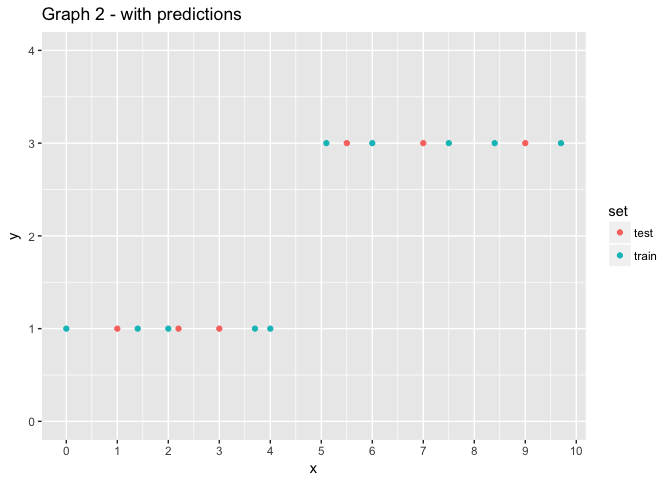
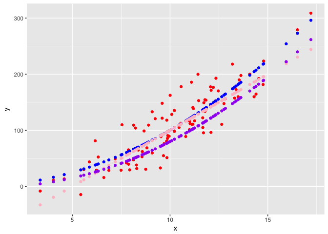

Supervised Learning
================

How to get set up for this workshop
-----------------------------------

### Our virtual space:

<http://backchannelchat.com/Backchannel/l9yzy>

### Getting this document on your computer:

1.  Go to the GitHub repository here: <https://github.com/davidklaing/data_science_workshops>
2.  Click the green button on the right that says "Clone or download".
3.  Click "Download ZIP". (If you're proficient with git, feel free to clone the repository.)
4.  Create a folder on your computer to store your work, and store your ZIP file there.
5.  Double-click your ZIP file to unzip it and get all the code.

### Getting R and Rstudio

1.  Download and install R from here: <http://cran.stat.sfu.ca/>.
2.  Download and install RStudio Desktop (Open Source Edition) from here: <https://www.rstudio.com/products/rstudio/#Desktop>.

### Getting ready to play!

1.  In RStudio, open `supervised_learning.Rmd`, a file in `YOUR_FOLDER/data_science_workshops/supervised_learning/src/`. (That's this file!)
2.  In the code snippet below, remove the hashtags from both lines, and click the green "play" button on the right to install `dplyr`, `ggplot2`, `purrr`, and `Lahman`, the four packages you'll need for the workshop.

``` r
#install.packages("dplyr")
#install.packages("ggplot2")
#install.packages("Lahman")
#install.packages("purrr")

library(dplyr)
```

    ## Warning: package 'dplyr' was built under R version 3.3.2

    ## 
    ## Attaching package: 'dplyr'

    ## The following objects are masked from 'package:stats':
    ## 
    ##     filter, lag

    ## The following objects are masked from 'package:base':
    ## 
    ##     intersect, setdiff, setequal, union

``` r
library(ggplot2)
```

    ## 
    ## Attaching package: 'ggplot2'

    ## The following object is masked from 'package:dplyr':
    ## 
    ##     vars

``` r
library(Lahman)
```

    ## Warning: package 'Lahman' was built under R version 3.3.2

``` r
library(purrr)
```

    ## Warning: package 'purrr' was built under R version 3.3.2

### Having installation problems?

Option 1: Ask for help! We have volunteers who can help troubleshoot.

Option 2a: Find a partner and follow along together — most of the exercises can be done collaboratively. Your installation problem is almost certainly solvable — we just might not have time today.

Option 2b: Use [this datacamp light](https://cdn.datacamp.com/dcl/standalone-example.html) page to write and execute code in your browser. (A couple caveats: doesn't come with the titanic data, and might end up distracting you from the lesson. If this is your first time programming, I recommend option 2a.)

Rstudio review
--------------

Executing code: move your cursor to the line you want to execute, and hit CTRL+ENTER

``` r
print("hello!")
```

    ## [1] "hello!"

``` r
1+1
```

    ## [1] 2

Looking up documentation about a function or object: prepend the name of the object with a question mark, and execute that line.

``` r
print
```

    ## function (x, ...) 
    ## UseMethod("print")
    ## <bytecode: 0x7fc7d6506ff0>
    ## <environment: namespace:base>

Supervised Learning
-------------------

In most programming:

-   Human writes a function, which allows the machine to take some data as an input and return some other data as an output.

For example:

``` r
add_one <- function(x) {
  return(x + 1)
}

add_one(2)
```

    ## [1] 3

``` r
add_one(5)
```

    ## [1] 6

``` r
add_one(0)
```

    ## [1] 1

In machine learning:

-   Human has a bunch of input-output pairs (like 2 and 3, 5 and 6, and 0 and 1), but doesn't know how to write a function that will transform the inputs into the outputs. So the human gives the input-output pairs to a machine learning algorithm, which learns the function we want!

``` r
learned_function <- function(inputs, outputs, new_input) {
  training_data <- data_frame(
    input = inputs,
    output = outputs
  )
  model <- lm(output~input, training_data)
  new_input_data <- data_frame(
    input = new_input
  )
  return(as.numeric(predict(model, new_input_data)))
}

learned_function(
  inputs = c(2, 5, 0),
  outputs = c(3, 6, 1),
  new_input = 3
)
```

    ## [1] 4

Throughout this workshop, we'll work toward applying a machine learning algorithm like the one above. But we're going to start out by trying to learn the appropriate function with our own eyes. In other words, we are going to be the ones doing the supervising.

Exercise
--------

Based on the graph below, how would you predict future values of *y* knowing only the corresponding values of *x*?

``` r
df1_train <- data_frame(
  x = c(0,1.1,2,3.3,4.4,5,6.2,7.7,8.1,9),
  y = c(0,2.2,4,6.6,8.8,10,12.4,15.2,16.2,18)
)

df1_train %>% 
  ggplot() +
  geom_point(
    aes(x = x, y = y)
  ) +
  scale_y_continuous(
    breaks = seq(0,20,2)
  ) +
  scale_x_continuous(
    breaks = c(0,1,2,3,4,5,6,7,8,9,10)
  ) +
  labs(
    title = "Graph 1"
  )
```


``` r
df1_train %>% 
  ggplot() +
  geom_histogram(
    aes(x = y)
  )
```

    ## `stat_bin()` using `bins = 30`. Pick better value with `binwidth`.


Write your function in the code snippet below.

``` r
predict1 <- function(x) {
  return(x*2)
}

df1_test <- data_frame(
  x = c(0.7, 3, 4, 5.7, 7.5)
) %>% 
  mutate(
    y = map_dbl(x, predict1),
    set = "test"
  )
```

    ## Warning: package 'bindrcpp' was built under R version 3.3.2

``` r
df1_train %>%
  mutate(set = "train") %>% 
  bind_rows(df1_test) %>% 
  ggplot() +
  geom_point(
    aes(x = x, y = y, color = set)
  ) +
  scale_y_continuous(
    breaks = seq(0,20,2)
  ) +
  scale_x_continuous(
    breaks = c(0,1,2,3,4,5,6,7,8,9,10)
  ) +
  labs(
    title = "Graph 1"
  )
```


Complication:

-   What if there are breaks in the distribution that make it impossible to represent the prediction function with a linear equation?

``` r
df2_train <- data_frame(
  x = c(0,1.4,2,3.7,4,5.1,6,7.5,8.4,9.7),
  y = c(1,1,1,1,1,3,3,3,3,3)
)

df2_train %>% 
  ggplot() +
  geom_point(
    aes(x = x, y = y)
  ) +
  scale_y_continuous(
    limits = c(0,4),
    breaks = c(0,1,2,3,4)
  ) +
  scale_x_continuous(
    breaks = c(0,1,2,3,4,5,6,7,8,9,10)
  ) +
  labs(
    title = "Graph 2"
  )
```


See if you can represent this new dataset with a different function.

Hint: you will need to use an `if` clause.

``` r
if (1 == 2) {
  print("hello")
} else {
  print("The first clause was false!")
}
```

    ## [1] "The first clause was false!"

``` r
predict2 <- function(x) {
  if (x < 4.5) {
    return(1)
  } else {
    return(3)
  }
}

df2_test <- data_frame(
  x = c(1, 2.2, 3, 5.5, 7, 9)
) %>% 
  mutate(
    y = map_dbl(x, predict2),
    set = "test"
  )

df2_train %>%
  mutate(set = "train") %>% 
  bind_rows(df2_test) %>% 
  ggplot() +
  geom_point(
    aes(x = x, y = y, color = set)
  ) +
  scale_y_continuous(
    limits = c(0,4),
    breaks = c(0,1,2,3,4)
  ) +
  scale_x_continuous(
    breaks = c(0,1,2,3,4,5,6,7,8,9,10)
  ) +
  labs(
    title = "Graph 2 - with predictions"
  )
```



Complication:

-   What if there is a source of error that causes equivalent inputs to have variable outputs?

``` r
df3_train <- read.csv("../data/df3_train.csv")

df3_train %>%
  ggplot() +
  geom_point(
    aes(
      x = x,
      y = y
    )
  ) +
  labs(title = "Graph 3")
```


By eyeballing the data, write your function in the snippet below. Once you're done, think about how you might evaluate the quality of your function. Can you come up with a measurement that you could use to compare your function to one written by someone else?

``` r
tania_predict <- function(x) {
  return(x*x)
}

cerize_predict <- function(x) {
  return(20*x - 100)
}

steffi_predict <- function(x) {
  return(x^2 - x*2)
}

df3_train %>% 
  mutate(
    tania_prediction = map_dbl(x, tania_predict),
    cerize_prediction = map_dbl(x, cerize_predict),
    steffi_prediction = map_dbl(x, steffi_predict)
  ) %>% 
  ggplot() +
  geom_point(aes(x = x, y = y), color = "red") +
  geom_point(aes(x = x, y = tania_prediction), color = "blue") +
  geom_point(aes(x = x, y = cerize_prediction), color = "pink") +
  geom_point(aes(x = x, y = steffi_prediction), color = "purple")
```



``` r
# How could you evaluate the quality of your function??
```

``` r
df3_train %>% 
  mutate(
    tania_prediction = map_dbl(x, tania_predict),
    cerize_prediction = map_dbl(x, cerize_predict),
    steffi_prediction = map_dbl(x, steffi_predict)
  ) %>%
  mutate(
    tania_error = tania_prediction - y,
    cerize_error = cerize_prediction - y,
    steffi_error = steffi_prediction - y
  ) %>% 
  summarise(
    mean_squared_tania_error = mean(tania_error^2),
    mean_squared_cerize_error = mean(cerize_error^2),
    mean_squared_steffi_error = mean(steffi_error^2),
  )
```

    ##   mean_squared_tania_error mean_squared_cerize_error
    ## 1                 818.8078                  878.3621
    ##   mean_squared_steffi_error
    ## 1                  1226.964

``` r
df3_test <- read.csv("../data/df3_test.csv")

df3_test %>% 
  ggplot() +
  geom_point(
    aes(x = x, y = y)
  )
```


``` r
df3_test %>% 
  mutate(
    tania_prediction = map_dbl(x, tania_predict),
    cerize_prediction = map_dbl(x, cerize_predict),
    steffi_prediction = map_dbl(x, steffi_predict)
  ) %>%
  mutate(
    tania_error = tania_prediction - y,
    cerize_error = cerize_prediction - y,
    steffi_error = steffi_prediction - y
  ) %>% 
  summarise(
    mean_squared_tania_error = mean(tania_error^2),
    mean_squared_cerize_error = mean(cerize_error^2),
    mean_squared_steffi_error = mean(steffi_error^2),
  )
```

    ##   mean_squared_tania_error mean_squared_cerize_error
    ## 1                 1191.448                  1573.639
    ##   mean_squared_steffi_error
    ## 1                   1644.79

Complication:

-   What if there are non-linearities in the data that make it difficult to define your function mathematically?

``` r
df4 <- data_frame(
  x = c(0,1.1,2,3.3,3.9,4.4,5,6.2,7.7,8.1,9),
  y = c(1.1,1.8,0.9,0.87,4.1,8.8,8.4,7.4,6,6.4,6.9)
)

df4 %>% 
  ggplot() +
  geom_point(
    aes(x = x, y = y)
  ) +
  scale_y_continuous(
    breaks = seq(0,20,2)
  ) +
  scale_x_continuous(
    breaks = c(0,1,2,3,4,5,6,7,8,9,10)
  ) +
  labs(
    title = "Graph 4"
  )
```


Further complications:

-   What if there are multiple predictor variables, making it impossible to visualize the whole system at once?

Say you want to predict a baseball player's salary using just their batting statistics:

``` r
baseball_stats <- Batting %>%
  inner_join(Salaries) %>% 
  filter(yearID == 2005)
```

    ## Joining, by = c("playerID", "yearID", "teamID", "lgID")

    ## Warning: Column `teamID` joining factors with different levels, coercing to
    ## character vector

    ## Warning: Column `lgID` joining factors with different levels, coercing to
    ## character vector

``` r
?Batting

baseball_stats
```

    ##      playerID yearID stint teamID lgID   G  AB   R   H X2B X3B HR RBI SB
    ## 1   abreubo01   2005     1    PHI   NL 162 588 104 168  37   1 24 102 31
    ## 2   adamsmi03   2005     1    MIL   NL  13   0   0   0   0   0  0   0  0
    ## 3   adamsru01   2005     1    TOR   AL 139 481  68 123  27   5  8  63 11
    ## 4   adamste01   2005     1    PHI   NL  16   0   0   0   0   0  0   0  0
    ## 5   affelje01   2005     1    KCA   AL  49   0   0   0   0   0  0   0  0
    ## 6   aguilch01   2005     1    FLO   NL  65  78  11  19   3   0  0   4  0
    ## 7   alfonan01   2005     1    FLO   NL  33   0   0   0   0   0  0   0  0
    ## 8   alfoned01   2005     1    SFN   NL 109 368  36 102  17   1  2  43  2
    ## 9   allench01   2005     1    TEX   AL  21  53   5  15   1   1  0   5  0
    ## 10  almanca01   2005     1    TEX   AL   6   0   0   0   0   0  0   0  0
    ## 11  alomasa02   2005     1    TEX   AL  46 128  11  35   7   0  0  14  0
    ## 12   aloumo01   2005     1    SFN   NL 123 427  67 137  21   3 19  63  5
    ## 13  alvarwi01   2005     1    LAN   NL  21   2   0   0   0   0  0   0  0
    ## 14  amezaal01   2005     1    COL   NL   2   3   1   1   0   0  0   0  0
    ## 15  anderbr02   2005     1    KCA   AL   6   0   0   0   0   0  0   0  0
    ## 16  anderga01   2005     1    LAA   AL 142 575  68 163  34   1 17  96  1
    ## 17  aquingr01   2005     1    ARI   NL  35   0   0   0   0   0  0   0  0
    ## 18  armasto02   2005     1    WAS   NL  19  32   1   4   0   0  0   0  0
    ## 19  arroybr01   2005     1    BOS   AL  35   1   0   0   0   0  0   0  0
    ## 20  astacpe01   2005     1    TEX   AL  12   1   0   0   0   0  0   0  0
    ## 21  atchisc01   2005     1    SEA   AL   6   0   0   0   0   0  0   0  0
    ## 22  atkinga01   2005     1    COL   NL 138 519  62 149  31   1 13  89  0
    ## 23  aurilri01   2005     1    CIN   NL 114 426  61 120  23   2 14  68  2
    ## 24  ausmubr01   2005     1    HOU   NL 134 387  35 100  19   0  3  47  5
    ## 25  ayalalu01   2005     1    WAS   NL  68   3   0   1   0   0  0   0  0
    ## 26  aybarma01   2005     1    NYN   NL  22   0   0   0   0   0  0   0  0
    ## 27  backebr01   2005     1    HOU   NL  28  45   5  10   2   2  0   6  1
    ## 28   baezda01   2005     1    TBA   AL  67   0   0   0   0   0  0   0  0
    ## 29  bagweje01   2005     1    HOU   NL  39 100  11  25   4   0  3  19  0
    ## 30  bakerje03   2005     1    COL   NL  12  38   6   8   4   0  1   4  0
    ## 31   bakopa01   2005     1    LAN   NL  13  40   1  10   2   0  0   4  0
    ## 32  barajro01   2005     1    TEX   AL 120 410  53 104  24   0 21  60  0
    ## 33   bardjo01   2005     1    CLE   AL  34  83   6  16   4   0  1   9  0
    ## 34  barmecl01   2005     1    COL   NL  81 350  55 101  19   1 10  46  6
    ## 35  barremi01   2005     1    CHN   NL 133 424  48 117  32   3 16  61  0
    ## 36  bartlja01   2005     1    MIN   AL  74 224  33  54  10   1  3  16  4
    ## 37  bartocl01   2005     1    CHN   NL  19   1   0   1   0   0  0   0  0
    ## 38  batismi01   2005     1    TOR   AL  71   0   0   0   0   0  0   0  0
    ## 39  bauerri01   2005     1    BAL   AL   5   0   0   0   0   0  0   0  0
    ## 40  bautide01   2005     1    KCA   AL   7   0   0   0   0   0  0   0  0
    ## 41    bayja01   2005     1    PIT   NL 162 599 110 183  44   6 32 101 21
    ## 42  beckejo02   2005     1    FLO   NL  29  59   5   9   3   0  1   6  0
    ## 43  bedarer01   2005     1    BAL   AL  24   0   0   0   0   0  0   0  0
    ## 44  belisma01   2005     1    CIN   NL  61   7   0   1   0   0  0   0  0
    ## 45   bellda01   2005     1    PHI   NL 150 557  53 138  31   1 10  61  0
    ## 46  bellhma01   2005     1    BOS   AL  85 283  41  61  20   0  7  28  3
    ## 47  belliro01   2005     1    CLE   AL 145 536  71 152  36   1 17  78  2
    ## 48   bellro01   2005     1    TBA   AL   8   0   0   0   0   0  0   0  0
    ## 49  beltrad01   2005     1    SEA   AL 156 603  69 154  36   1 19  87  3
    ## 50  beltrca01   2005     1    NYN   NL 151 582  83 155  34   2 16  78 17
    ## 51  benitar01   2005     1    SFN   NL  30   0   0   0   0   0  0   0  0
    ## 52  bennega01   2005     1    WAS   NL  68 199  11  44   7   0  1  21  0
    ## 53  benoijo01   2005     1    TEX   AL  33   1   0   0   0   0  0   0  0
    ## 54  bensokr01   2005     1    NYN   NL  28  49   4   9   1   0  0   6  0
    ## 55  berkmla01   2005     1    HOU   NL 132 468  76 137  34   1 24  82  4
    ## 56  bernead01   2005     1    ATL   NL  36   1   0   1   0   0  0   0  0
    ## 57  berroan01   2005     1    KCA   AL 159 608  68 164  21   5 11  55  7
    ## 58  betanra01   2005     1    CLE   AL  54   0   0   0   0   0  0   0  0
    ## 59  betemwi01   2005     1    ATL   NL 115 246  36  75  12   4  4  20  1
    ## 60  bigbila01   2005     1    BAL   AL  67 206  22  51   9   1  5  21  3
    ## 61  biggicr01   2005     1    HOU   NL 155 590  94 156  40   1 26  69 11
    ## 62  blakeca01   2005     1    CLE   AL 147 523  72 126  32   1 23  58  4
    ## 63  blaloha01   2005     1    TEX   AL 161 647  80 170  34   0 25  92  1
    ## 64  blanche01   2005     1    CHN   NL  54 161  16  39   6   0  6  25  0
    ## 65  blancto01   2005     1    WAS   NL  56  62   7  11   3   0  1   7  1
    ## 66  blantjo01   2005     1    OAK   AL  33   3   0   1   0   0  0   0  0
    ## 67  bloomwi01   2005     1    SEA   AL  82 249  27  64  15   2  0  22 14
    ## 68   blumge01   2005     1    SDN   NL  78 224  26  54  13   1  5  22  3
    ## 69  bondeje01   2005     1    DET   AL  29   6   0   0   0   0  0   0  0
    ## 70  bondsba01   2005     1    SFN   NL  14  42   8  12   1   0  5  10  0
    ## 71  booneaa01   2005     1    CLE   AL 143 511  61 124  19   1 16  60  9
    ## 72  boonebr01   2005     1    SEA   AL  74 273  30  63  15   3  7  34  4
    ## 73  borowjo01   2005     1    CHN   NL  11   0   0   0   0   0  0   0  0
    ## 74  bottari01   2005     1    MIL   NL  40   0   0   0   0   0  0   0  0
    ## 75  bradlmi01   2005     1    LAN   NL  75 283  49  82  14   1 13  38  6
    ## 76  branyru01   2005     1    MIL   NL  85 202  23  52  11   0 12  31  1
    ## 77  brazede01   2005     1    TBA   AL  20   0   0   0   0   0  0   0  0
    ## 78  brazoyh01   2005     1    LAN   NL  74   2   0   0   0   0  0   0  0
    ## 79  brocado01   2005     1    TEX   AL  61   0   0   0   0   0  0   0  0
    ## 80  brousbe01   2005     1    CLE   AL 142 466  59 119  30   5 19  68  2
    ## 81  broweji01   2005     1    SFN   NL  32   2   0   0   0   0  0   0  0
    ## 82  brownem01   2005     1    KCA   AL 150 545  75 156  31   5 17  86 10
    ## 83  brownke01   2005     1    NYA   AL  13   2   0   1   1   0  0   0  0
    ## 84  brunebr01   2005     1    ARI   NL  47   1   0   0   0   0  0   0  0
    ## 85  brunter01   2005     1    HOU   NL  91 109  19  24   5   2  4  14  7
    ## 86   buckjo01   2005     1    KCA   AL 118 401  40  97  21   1 12  47  2
    ## 87  buehrma01   2005     1    CHA   AL  33   3   0   0   0   0  0   0  0
    ## 88  bukviry01   2005     1    TEX   AL   4   0   0   0   0   0  0   0  0
    ## 89   bumpna01   2005     1    FLO   NL  31   5   1   1   0   0  0   0  0
    ## 90  burkech01   2005     1    HOU   NL 108 318  49  79  19   2  5  26 11
    ## 91  burneaj01   2005     1    FLO   NL  32  68   3  10   2   2  1   2  0
    ## 92  burnije01   2005     1    CHN   NL 160 605  84 156  31   2 24  87  5
    ## 93  burrepa01   2005     1    PHI   NL 154 562  78 158  27   1 32 117  0
    ## 94  burrose01   2005     1    SDN   NL  93 284  20  71   7   2  1  17  4
    ## 95   bushda01   2005     1    TOR   AL  25   0   0   0   0   0  0   0  0
    ## 96   byrdpa01   2005     1    LAA   AL  31   4   0   1   0   0  0   0  0
    ## 97  byrneer01   2005     1    OAK   AL  59 192  30  51  15   2  7  24  2
    ## 98  cabreda01   2005     1    BAL   AL  29   1   0   0   0   0  0   0  0
    ## 99  cabremi01   2005     1    FLO   NL 158 613 106 198  43   2 33 116  1
    ## 100 cabreor01   2005     1    LAA   AL 141 540  70 139  28   3  8  57 21
    ## 101 cairomi01   2005     1    NYN   NL 100 327  31  82  18   0  2  19 13
    ## 102 calerki01   2005     1    OAK   AL  58   1   0   0   0   0  0   0  0
    ## 103 camermi01   2005     1    NYN   NL  76 308  47  84  23   2 12  39 13
    ## 104  campsh01   2005     1    KCA   AL  29   0   0   0   0   0  0   0  0
    ## 105 cantujo01   2005     1    TBA   AL 150 598  73 171  40   1 28 117  1
    ## 106 capuach01   2005     1    MIL   NL  35  71   5  12   3   0  0   9  0
    ## 107 carlybu01   2005     1    LAN   NL  10   0   0   0   0   0  0   0  0
    ## 108 carpech01   2005     1    SLN   NL  33  77   7   5   2   0  0   2  0
    ## 109 carragi01   2005     1    LAN   NL  72   1   0   0   0   0  0   0  0
    ## 110 carroja01   2005     1    WAS   NL 113 303  44  76   8   1  0  22  3
    ## 111 cartela02   2005     1    TBA   AL  39   0   0   0   0   0  0   0  0
    ## 112 carvama01   2005     1    COL   NL  39   4   0   1   0   0  0   2  0
    ## 113 caseyse01   2005     1    CIN   NL 137 529  75 165  32   0  9  58  2
    ## 114  cashke01   2005     1    TBA   AL  13  31   4   5   1   0  2   2  0
    ## 115 castial01   2005     1    KCA   AL  34 100  13  21   5   1  1  14  1
    ## 116 castijo02   2005     1    PIT   NL 101 370  49  99  16   3 11  53  2
    ## 117 castilu01   2005     1    FLO   NL 122 439  72 132  12   4  4  30 10
    ## 118 castivi02   2005     1    WAS   NL 142 494  53 125  36   1 12  66  4
    ## 119 castrju01   2005     1    MIN   AL  97 272  27  70  18   1  5  33  0
    ## 120 castrra01   2005     1    NYN   NL  99 209  26  51  16   0  8  41  1
    ## 121 catalfr01   2005     1    TOR   AL 130 419  56 126  29   5  8  59  0
    ## 122 cedenro01   2005     1    SLN   NL  37  57   4   9   1   0  0   8  0
    ## 123 cerdaja01   2005     1    KCA   AL  20   0   0   0   0   0  0   0  0
    ## 124 chacigu01   2005     1    TOR   AL  34   7   1   0   0   0  0   0  0
    ## 125 chacosh01   2005     1    COL   NL  13  20   0   3   0   0  0   1  0
    ## 126 chaveer01   2005     1    OAK   AL 160 625  92 168  40   1 27 101  6
    ## 127 chavera01   2005     1    HOU   NL  37  99   6  17   3   0  2   6  1
    ## 128  chenbr01   2005     1    BAL   AL  34   3   0   1   0   0  0   0  0
    ## 129 choatra01   2005     1    ARI   NL   8   0   0   0   0   0  0   0  0
    ## 130  choihe01   2005     1    LAN   NL 133 320  40  81  15   2 15  42  1
    ## 131 chrisja01   2005     1    SFN   NL  56   0   0   0   0   0  0   0  0
    ## 132 chulkvi01   2005     1    TOR   AL  62   0   0   0   0   0  0   0  0
    ## 133 churcry01   2005     1    WAS   NL 102 268  41  77  15   3  9  42  3
    ## 134 cintral01   2005     1    ARI   NL 122 330  36  90  19   2  8  48  1
    ## 135 cirilje01   2005     1    MIL   NL  77 185  29  52  15   0  4  23  4
    ## 136 clarkbr02   2005     1    MIL   NL 145 599  94 183  31   1 13  53 10
    ## 137 clarkto02   2005     1    ARI   NL 130 349  47 106  22   2 30  87  0
    ## 138 clausbr01   2005     1    CIN   NL  29  55   3   5   0   0  0   0  0
    ## 139 claytro01   2005     1    ARI   NL 143 522  59 141  28   4  2  44 13
    ## 140 clemema01   2005     1    BOS   AL  32   3   0   0   0   0  0   0  0
    ## 141 clemero02   2005     1    HOU   NL  32  58   2  12   2   0  0   4  0
    ## 142 clossjd01   2005     1    COL   NL  92 237  31  52  12   2  7  27  1
    ## 143 colomje01   2005     1    TBA   AL  36   0   0   0   0   0  0   0  0
    ## 144 colonba01   2005     1    LAA   AL  33   3   0   1   0   0  0   1  0
    ## 145 colonro01   2005     1    ATL   NL  23   7   0   0   0   0  0   0  0
    ## 146 coninje01   2005     1    FLO   NL 131 335  42 102  20   2  3  33  2
    ## 147 contrjo01   2005     1    CHA   AL  32   3   0   0   0   0  0   0  0
    ## 148  cookaa01   2005     1    COL   NL  13  30   3   5   0   1  0   0  0
    ## 149  coraal01   2005     1    CLE   AL  49 146  11  30   5   2  1   8  6
    ## 150 cordech01   2005     1    WAS   NL  74   0   0   0   0   0  0   0  0
    ## 151 cordefr01   2005     1    TEX   AL  69   0   0   0   0   0  0   0  0
    ## 152 cordewi01   2005     1    WAS   NL  29  51   2   6   2   0  0   2  0
    ## 153 cormirh01   2005     1    PHI   NL  57   1   0   0   0   0  0   0  0
    ## 154  cotahu01   2005     1    PIT   NL  93 297  29  72  20   1  7  43  0
    ## 155 cottsne01   2005     1    CHA   AL  69   0   0   0   0   0  0   0  0
    ## 156 counscr01   2005     1    ARI   NL 150 578  85 148  34   4  9  42 26
    ## 157 crainje01   2005     1    MIN   AL  75   0   0   0   0   0  0   0  0
    ## 158 crawfca02   2005     1    TBA   AL 156 644 101 194  33  15 15  81 46
    ## 159 credejo01   2005     1    CHA   AL 132 432  54 109  21   0 22  62  1
    ## 160 crispco01   2005     1    CLE   AL 145 594  86 178  42   4 16  69 15
    ## 161 crosbbo01   2005     1    OAK   AL  84 333  66  92  25   4  9  38  0
    ## 162 crosbbu01   2005     1    NYA   AL  76  98  15  27   0   1  1   6  4
    ## 163  cruzde01   2005     1    SFN   NL  81 209  26  56  10   1  5  19  0
    ## 164  cruzja01   2005     1    CIN   NL 110 127  12  30  10   0  4  18  0
    ## 165  cruzjo02   2005     1    ARI   NL  64 202  23  43   9   0 12  28  0
    ## 166  cruzju02   2005     1    OAK   AL  28   0   0   0   0   0  0   0  0
    ## 167 cuddymi01   2005     1    MIN   AL 126 422  55 111  25   3 12  42  3
    ## 168 damonjo01   2005     1    BOS   AL 148 624 117 197  35   6 10  75 18
    ## 169 davanje02   2005     1    LAA   AL 108 225  42  52  10   1  2  15 11
    ## 170 davisdo02   2005     1    MIL   NL  35  73   2  10   3   1  0   3  0
    ## 171 davisja02   2005     1    CLE   AL  11   2   0   0   0   0  0   0  0
    ## 172 davisjj01   2005     1    WAS   NL  14  26   0   6   0   0  0   2  1
    ## 173   dayza01   2005     1    WAS   NL  12   8   0   1   0   0  0   0  0
    ## 174 dejeami01   2005     1    NYN   NL  29   0   0   0   0   0  0   0  0
    ## 175 dejesda01   2005     1    KCA   AL 122 461  69 135  31   6  9  56  5
    ## 176 delarjo01   2005     1    MIL   NL  38   0   0   0   0   0  0   0  0
    ## 177 delgaca01   2005     1    FLO   NL 144 521  81 157  41   3 33 115  0
    ## 178 delluda01   2005     1    TEX   AL 128 435  97 109  17   5 29  65  5
    ## 179 dempsry01   2005     1    CHN   NL  63  14   0   1   0   0  0   0  0
    ## 180 derosma01   2005     1    TEX   AL  66 148  26  36   5   0  8  20  1
    ## 181 desseel01   2005     1    LAN   NL  28  10   0   0   0   0  0   0  0
    ## 182  diazei01   2005     1    SLN   NL  58 130  14  27   6   0  1  17  0
    ## 183 dickera01   2005     1    TEX   AL   9   0   0   0   0   0  0   0  0
    ## 184 dobbsgr01   2005     1    SEA   AL  59 142   8  35   7   1  1  20  1
    ## 185 dohmasc01   2005     1    COL   NL  32   1   0   0   0   0  0   0  0
    ## 186 donnebr01   2005     1    LAA   AL  66   1   0   0   0   0  0   0  0
    ## 187 doteloc01   2005     1    OAK   AL  15   0   0   0   0   0  0   0  0
    ## 188 dresery01   2005     1    TEX   AL  12   1   0   0   0   0  0   0  0
    ## 189  drewjd01   2005     1    LAN   NL  72 252  48  72  12   1 15  36  1
    ## 190 duboija01   2005     1    CHN   NL  52 142  15  34  12   0  7  22  0
    ## 191 duchsju01   2005     1    OAK   AL  65   0   0   0   0   0  0   0  0
    ## 192 duckwbr01   2005     1    HOU   NL   7   3   1   2   1   0  0   0  0
    ## 193  dunnad01   2005     1    CIN   NL 160 543 107 134  35   2 40 101  4
    ## 194 durazer01   2005     1    OAK   AL  41 152  15  36   6   1  4  16  1
    ## 195 durhara01   2005     1    SFN   NL 142 497  67 144  33   0 12  62  6
    ## 196   dyeje01   2005     1    CHA   AL 145 529  74 145  29   2 31  86 11
    ## 197 easleda01   2005     1    FLO   NL 102 267  37  64  19   1  9  30  4
    ## 198 eatonad01   2005     1    SDN   NL  26  46   2   8   0   1  0   2  0
    ## 199 eckstda01   2005     1    SLN   NL 158 630  90 185  26   7  8  61 11
    ## 200 edmonji01   2005     1    SLN   NL 142 467  88 123  37   1 29  89  5
    ## 201 eischjo01   2005     1    WAS   NL  58   3   0   1   0   0  0   0  0
    ## 202 elartsc01   2005     1    CLE   AL  31   2   0   0   0   0  0   0  0
    ## 203 eldreca01   2005     1    SLN   NL  31   2   0   0   0   0  0   0  0
    ## 204 ellisja01   2005     1    SFN   NL 131 352  49  93  18   2  4  24 14
    ## 205 ellisma01   2005     1    OAK   AL 122 434  76 137  21   5 13  52  1
    ## 206 embreal01   2005     1    BOS   AL  43   0   0   0   0   0  0   0  0
    ## 207 encarju01   2005     1    FLO   NL 141 506  59 145  27   3 16  76  6
    ## 208 ensbemo01   2005     1    HOU   NL 150 526  86 149  30   3 36 101  6
    ## 209 ericksc01   2005     1    LAN   NL  19  13   0   2   0   0  0   0  0
    ## 210 erstada01   2005     1    LAA   AL 153 609  86 166  33   3  7  66 10
    ## 211 escobke01   2005     1    LAA   AL  16   1   0   0   0   0  0   0  0
    ## 212 estessh01   2005     1    ARI   NL  21  29   2   2   0   1  0   0  1
    ## 213 estrajo01   2005     1    ATL   NL 105 357  31  93  26   0  4  39  0
    ## 214 everead01   2005     1    HOU   NL 152 549  58 136  27   2 11  54 21
    ## 215 evereca01   2005     1    CHA   AL 135 490  58 123  17   2 23  87  4
    ## 216  eyresc01   2005     1    SFN   NL  86   2   0   0   0   0  0   0  0
    ## 217 farnsky01   2005     1    DET   AL  46   0   0   0   0   0  0   0  0
    ## 218 fasseje01   2005     1    SFN   NL  48  13   0   0   0   0  0   0  0
    ## 219 felizpe01   2005     1    SFN   NL 156 569  69 142  30   4 20  81  0
    ## 220 fieldna01   2005     1    KCA   AL   7   0   0   0   0   0  0   0  0
    ## 221 figgich01   2005     1    LAA   AL 158 642 113 186  25  10  8  57 62
    ## 222 finlest01   2005     1    LAA   AL 112 406  41  90  20   3 12  54  8
    ## 223 flahejo01   2005     1    NYA   AL  47 127  10  21   5   0  2  11  0
    ## 224 florera01   2005     1    SLN   NL  50   1   0   0   0   0  0   0  0
    ## 225 floydcl01   2005     1    NYN   NL 150 550  85 150  22   2 34  98 12
    ## 226 floydga01   2005     1    PHI   NL   7   9   0   1   0   0  0   0  0
    ## 227  foggjo01   2005     1    PIT   NL  34  47   3   5   1   0  0   3  0
    ## 228  fordle01   2005     1    MIN   AL 147 522  70 138  30   4  7  53 13
    ## 229 fossuca01   2005     1    TBA   AL  36   2   0   0   0   0  0   0  0
    ## 230 foulkke01   2005     1    BOS   AL  43   0   0   0   0   0  0   0  0
    ## 231   foxch02   2005     1    CHN   NL  11   0   0   0   0   0  0   0  0
    ## 232 francje01   2005     1    COL   NL  33  58   7   6   2   0  0   4  0
    ## 233 francjo01   2005     1    HOU   NL  31   0   0   0   0   0  0   0  0
    ## 234 francju01   2005     1    ATL   NL 108 233  30  64  12   1  9  42  4
    ## 235 frankry01   2005     1    SEA   AL  32   4   0   0   0   0  0   0  0
    ## 236 frasoja01   2005     1    TOR   AL  67   0   0   0   0   0  0   0  0
    ## 237 freelry01   2005     1    CIN   NL 103 369  69 100  19   3  4  21 36
    ## 238 fuentbr01   2005     1    COL   NL  78   0   0   0   0   0  0   0  0
    ## 239 fultzaa01   2005     1    PHI   NL  62   3   1   1   0   0  0   0  0
    ## 240 furcara01   2005     1    ATL   NL 154 616 100 175  31  11 12  58 46
    ## 241 gagneer01   2005     1    LAN   NL  14   0   0   0   0   0  0   0  0
    ## 242 garcifr02   2005     1    CHA   AL  33   7   0   0   0   0  0   0  0
    ## 243 garcino01   2005     1    CHN   NL  62 230  28  65  12   0  9  30  0
    ## 244 garlajo01   2005     1    CHA   AL  32   2   0   1   0   0  0   1  0
    ## 245 germafr01   2005     1    DET   AL  58   0   0   0   0   0  0   0  0
    ## 246 gerutjo01   2005     1    CLE   AL  44 138  12  38   9   1  1  12  1
    ## 247 giambja01   2005     1    NYA   AL 139 417  74 113  14   0 32  87  0
    ## 248 gibboja01   2005     1    BAL   AL 139 488  72 135  33   3 26  79  0
    ## 249 gilesbr02   2005     1    SDN   NL 158 545  92 164  38   8 15  83 13
    ## 250 gilesma01   2005     1    ATL   NL 152 577 104 168  45   4 15  63 16
    ## 251   gilge01   2005     1    BAL   AL  64 125   7  24   3   0  4  17  0
    ## 252 ginteke01   2005     1    OAK   AL  51 137  12  22   5   0  3  25  0
    ## 253 gintema01   2005     1    DET   AL  14   0   0   0   0   0  0   0  0
    ## 254 glaustr01   2005     1    ARI   NL 149 538  78 139  29   1 37  97  4
    ## 255 glavito02   2005     1    NYN   NL  33  64   2  13   0   0  0   3  0
    ## 256 gloadro01   2005     1    CHA   AL  28  42   2   7   2   0  0   5  0
    ## 257 glovega01   2005     1    MIL   NL  15  20   3   2   0   0  0   1  0
    ## 258 gomezch02   2005     1    BAL   AL  89 219  27  61  11   0  1  18  2
    ## 259 gonzaad01   2005     1    TEX   AL  43 150  17  34   7   1  6  17  0
    ## 260 gonzaal01   2005     1    TBA   AL 109 349  47  94  20   1  9  38  2
    ## 261 gonzaal02   2005     1    FLO   NL 130 435  45 115  30   0  5  45  5
    ## 262 gonzaju03   2005     1    CLE   AL   1   1   0   0   0   0  0   0  0
    ## 263 gonzalu01   2005     1    ARI   NL 155 579  90 157  37   0 24  79  4
    ## 264 gonzalu02   2005     1    COL   NL 128 404  51 118  25   0  9  44  3
    ## 265 gonzami02   2005     1    PIT   NL  51   0   0   0   0   0  0   0  0
    ## 266 gordoto01   2005     1    NYA   AL  79   0   0   0   0   0  0   0  0
    ## 267 goslimi01   2005     1    ARI   NL  13   6   0   0   0   0  0   0  0
    ## 268 gotayru01   2005     1    KCA   AL  86 282  32  64  14   2  5  29  2
    ## 269 graboja01   2005     1    LAN   NL  65 112  14  18   0   0  4  12  1
    ## 270 grabojo02   2005     1    PIT   NL  63   0   0   0   0   0  0   0  0
    ## 271 graffto01   2005     1    KCA   AL  59 191  29  57   5   2  3  18  3
    ## 272 graveda01   2005     1    CIN   NL  20   0   0   0   0   0  0   0  0
    ## 273 greenkh01   2005     1    SDN   NL 121 436  51 109  30   2 15  70  5
    ## 274 greenni01   2005     1    TBA   AL 111 318  53  76  15   2  5  29  3
    ## 275 greensh01   2005     1    ARI   NL 158 581  87 166  37   4 22  73  8
    ## 276 greento02   2005     1    COL   NL  38 126  10  32   4   0  7  23  0
    ## 277 greggke01   2005     1    LAA   AL  33   0   0   0   0   0  0   0  0
    ## 278 greinza01   2005     1    KCA   AL  33   2   1   1   0   0  1   1  0
    ## 279 griffke02   2005     1    CIN   NL 128 491  85 148  30   0 35  92  0
    ## 280 grimsja01   2005     1    BAL   AL  22   0   0   0   0   0  0   0  0
    ## 281 grissma02   2005     1    SFN   NL  44 137   8  29   4   0  2  15  1
    ## 282 grossga01   2005     1    TOR   AL  40  92  11  23   4   1  1   7  1
    ## 283 grudzma01   2005     1    SLN   NL 137 528  64 155  30   3  8  59  8
    ## 284 gryboke01   2005     1    ATL   NL  31   0   0   0   0   0  0   0  0
    ## 285 guarded01   2005     1    SEA   AL  58   0   0   0   0   0  0   0  0
    ## 286 guerrma02   2005     1    MIN   AL  43   1   0   0   0   0  0   0  0
    ## 287 guerrvl01   2005     1    LAA   AL 141 520  95 165  29   2 32 108 13
    ## 288 guillca01   2005     1    DET   AL  87 334  48 107  15   4  5  23  2
    ## 289 guilljo01   2005     1    WAS   NL 148 551  81 156  32   2 24  76  1
    ## 290 guzmacr01   2005     1    WAS   NL 142 456  39 100  19   6  4  31  7
    ## 291 hafnetr01   2005     1    CLE   AL 137 486  94 148  42   0 33 108  0
    ## 292 hairsje02   2005     1    CHN   NL 114 380  51  99  25   2  4  30  8
    ## 293 halamjo01   2005     1    BOS   AL  30   0   0   0   0   0  0   0  0
    ## 294 hallaro01   2005     1    TOR   AL  19   2   0   0   0   0  0   0  0
    ## 295  hallbi03   2005     1    MIL   NL 146 501  69 146  39   6 17  62 18
    ## 296  hallto02   2005     1    TBA   AL 135 432  28 124  20   0  5  48  0
    ## 297 halsebr01   2005     1    ARI   NL  28  48   2   3   0   0  0   2  0
    ## 298 hammoch01   2005     1    SDN   NL  55   3   0   0   0   0  0   0  0
    ## 299 hamptmi01   2005     1    ATL   NL  12  25   4   8   1   0  1   1  0
    ## 300 hancojo01   2005     1    CIN   NL  11   0   0   0   0   0  0   0  0
    ## 301 haranaa01   2005     1    CIN   NL  32  74   1   2   0   0  0   3  0
    ## 302 harderi01   2005     1    OAK   AL  22   0   0   0   0   0  0   0  0
    ## 303 hardyjj01   2005     1    MIL   NL 124 372  46  92  22   1  9  50  0
    ## 304 harenda01   2005     1    OAK   AL  34   5   0   2   1   0  0   2  0
    ## 305 harpetr01   2005     1    TBA   AL  52   1   0   0   0   0  0   0  0
    ## 306 harrile01   2005     1    FLO   NL  83  70   5  22   4   0  1  13  0
    ## 307 harriwi01   2005     1    CHA   AL  56 121  17  31   2   1  1   8 10
    ## 308 harvich01   2005     1    HOU   NL  37   1   0   0   0   0  0   0  0
    ## 309 hasegsh01   2005     1    SEA   AL  46   0   0   0   0   0  0   0  0
    ## 310 hattesc01   2005     1    OAK   AL 134 464  52 119  19   0  7  59  0
    ## 311 hawkila01   2005     1    CHN   NL  21   0   0   0   0   0  0   0  0
    ## 312 hawpebr01   2005     1    COL   NL 101 305  38  80  10   3  9  47  2
    ## 313 helmswe01   2005     1    MIL   NL  95 168  18  50  13   1  4  24  0
    ## 314 heltoto01   2005     1    COL   NL 144 509  92 163  45   2 20  79  3
    ## 315 hendrma01   2005     1    TBA   AL  31   7   1   1   0   0  0   0  0
    ## 316 heredfe01   2005     1    NYN   NL   3   0   0   0   0   0  0   0  0
    ## 317 hergema01   2005     1    SFN   NL  21   0   0   0   0   0  0   0  0
    ## 318 hermadu01   2005     1    CHA   AL  57   0   0   0   0   0  0   0  0
    ## 319 hernajo01   2005     1    CLE   AL  84 234  28  54   7   0  6  31  1
    ## 320 hernali01   2005     1    WAS   NL  35  82   7  20   2   1  2   7  0
    ## 321 hernaor01   2005     1    CHA   AL  24   3   0   1   0   0  0   0  0
    ## 322 hernara02   2005     1    SDN   NL  99 369  36 107  19   2 12  58  1
    ## 323 hernaro01   2005     1    NYN   NL  67   0   0   0   0   0  0   0  0
    ## 324 hernaru03   2005     1    KCA   AL  29   5   0   0   0   0  0   0  0
    ## 325 hidalri01   2005     1    TEX   AL  88 308  43  68  12   0 16  43  1
    ## 326 higgibo02   2005     1    DET   AL  10  26   1   2   0   0  0   1  0
    ## 327  hillbo01   2005     1    PIT   NL  58  93  12  25   6   0  0  11  0
    ## 328 hillesh02   2005     1    TOR   AL 152 594  91 173  36   2 18  82  5
    ## 329  hillko01   2005     1    ARI   NL  34  78   6  17   5   0  0   6  0
    ## 330 hinsker01   2005     1    TOR   AL 147 477  79 125  31   2 15  68  8
    ## 331 hoffmtr01   2005     1    SDN   NL  60   0   0   0   0   0  0   0  0
    ## 332 hollato01   2005     1    CHN   NL 107 268  23  68  17   2  5  35  4
    ## 333 hollima01   2005     1    COL   NL 125 479  68 147  24   7 19  87 14
    ## 334 horgajo01   2005     1    WAS   NL   8   0   0   0   0   0  0   0  0
    ## 335 houltdj01   2005     1    LAN   NL  35  30   1   3   1   0  0   1  0
    ## 336 howrybo01   2005     1    CLE   AL  79   1   0   0   0   0  0   0  0
    ## 337 hudsolu01   2005     1    CIN   NL  21  25   7   8   2   0  0   3  0
    ## 338 hudsoor01   2005     1    TOR   AL 131 461  62 125  25   5 10  63  7
    ## 339 hudsoti01   2005     1    ATL   NL  29  65   2   9   2   1  0   6  0
    ## 340  huffau01   2005     1    TBA   AL 154 575  70 150  26   2 22  92  8
    ## 341 hunteto01   2005     1    MIN   AL  98 372  63 100  24   1 14  56 23
    ## 342 hyzduad01   2005     1    SDN   NL  17  20   1   3   1   0  0   4  1
    ## 343 ibanera01   2005     1    SEA   AL 162 614  92 172  32   2 20  89  9
    ## 344 iguchta01   2005     1    CHA   AL 135 511  74 142  25   6 15  71 15
    ## 345 infanom01   2005     1    DET   AL 121 406  36  90  28   2  9  43  8
    ## 346  ingebr01   2005     1    DET   AL 160 616  75 161  31   9 16  72  7
    ## 347 ishiika01   2005     1    NYN   NL  19  25   1   5   0   0  0   2  0
    ## 348 isrinja01   2005     1    SLN   NL  63   0   0   0   0   0  0   0  0
    ## 349 izturce01   2005     1    LAN   NL 106 444  48 114  19   2  2  31  8
    ## 350 izturma01   2005     1    LAA   AL  77 191  18  47   8   4  1  15  9
    ## 351 jenkige01   2005     1    MIL   NL 148 538  87 157  42   1 25  86  0
    ## 352 jennija01   2005     1    COL   NL  22  38   0   6   1   0  0   1  0
    ## 353 jeterde01   2005     1    NYA   AL 159 654 122 202  25   5 19  70 14
    ## 354 jimenda01   2005     1    CIN   NL  35 105  14  24   7   0  0   5  2
    ## 355 johnsja02   2005     1    DET   AL  33   2   1   1   0   0  1   1  0
    ## 356 johnsni01   2005     1    WAS   NL 131 453  66 131  35   3 15  74  3
    ## 357 johnsra05   2005     1    NYA   AL  34   8   0   0   0   0  0   0  0
    ## 358 johnsre02   2005     1    TOR   AL 142 398  55 107  21   6  8  58  5
    ## 359 jonesan01   2005     1    ATL   NL 160 586  95 154  24   3 51 128  5
    ## 360 jonesch06   2005     1    ATL   NL 109 358  66 106  30   0 21  72  5
    ## 361 jonesja04   2005     1    MIN   AL 142 523  74 130  22   4 23  73 13
    ## 362 jonesto02   2005     1    FLO   NL  68   3   0   1   0   0  0   0  0
    ## 363 jordabr01   2005     1    ATL   NL  76 231  25  57   8   2  3  24  2
    ## 364 juliojo01   2005     1    BAL   AL  67   0   0   0   0   0  0   0  0
    ## 365 karsast01   2005     1    NYA   AL   6   0   0   0   0   0  0   0  0
    ## 366  katama01   2005     1    ARI   NL  30  31   6   6   2   1  0   0  0
    ## 367 kazmisc01   2005     1    TBA   AL  32   1   0   0   0   0  0   0  0
    ## 368 kearnau01   2005     1    CIN   NL 112 387  62  93  26   1 18  67  0
    ## 369 kendaja01   2005     1    OAK   AL 150 601  70 163  28   1  0  53  8
    ## 370 kennead01   2005     1    LAA   AL 129 416  49 125  23   0  2  37 19
    ## 371 kennejo04   2005     1    COL   NL  16  29   1   5   0   0  0   1  0
    ## 372  kentje01   2005     1    LAN   NL 149 553 100 160  36   0 29 105  6
    ## 373 kieltbo01   2005     1    OAK   AL 116 377  55  99  20   0 10  57  3
    ## 374   kimby01   2005     1    COL   NL  40  38   0   3   0   0  0   2  0
    ## 375  kingra01   2005     1    SLN   NL  77   0   0   0   0   0  0   0  0
    ## 376 kleskry01   2005     1    SDN   NL 137 443  61 110  19   1 18  58  3
    ## 377 klinest02   2005     1    BAL   AL  67   0   0   0   0   0  0   0  0
    ## 378  kolbda01   2005     1    ATL   NL  65   1   0   0   0   0  0   0  0
    ## 379 konerpa01   2005     1    CHA   AL 158 575  98 163  24   0 40 100  0
    ## 380   kooda01   2005     1    NYN   NL  33   2   1   1   1   0  0   0  0
    ## 381 koplomi01   2005     1    ARI   NL  44   2   0   0   0   0  0   0  0
    ## 382 koskico01   2005     1    TOR   AL  97 354  49  88  20   0 11  36  4
    ## 383 kotsama01   2005     1    OAK   AL 139 582  75 163  35   1 15  82  5
    ## 384 lackejo01   2005     1    LAA   AL  33   6   0   0   0   0  0   0  0
    ## 385  lambmi01   2005     1    HOU   NL 125 322  41  76  13   5 12  53  1
    ## 386  laneja01   2005     1    HOU   NL 145 517  65 138  34   4 26  78  6
    ## 387 langery01   2005     1    ATL   NL 128 326  48  87  22   3  8  42  0
    ## 388 larocad01   2005     1    ATL   NL 141 451  53 117  28   0 20  78  0
    ## 389 larueja01   2005     1    CIN   NL 110 361  38  94  27   0 14  60  0
    ## 390 lawrebr02   2005     1    SDN   NL  33  59   2   5   0   0  0   1  0
    ## 391 lawtoma02   2005     1    PIT   NL 101 374  53 102  28   1 10  44 16
    ## 392 leagubr01   2005     1    TOR   AL  20   0   0   0   0   0  0   0  0
    ## 393 lecroma01   2005     1    MIN   AL 101 304  33  79   5   0 17  50  0
    ## 394 ledeeri01   2005     1    LAN   NL 102 237  31  66  16   1  7  39  0
    ## 395 ledezwi01   2005     1    DET   AL  10   0   0   0   0   0  0   0  0
    ## 396   leeca01   2005     1    MIL   NL 162 618  85 164  41   0 32 114 13
    ## 397   leecl02   2005     1    CLE   AL  32   8   0   0   0   0  0   0  0
    ## 398   leede02   2005     1    CHN   NL 158 594 120 199  50   3 46 107 15
    ## 399   leetr01   2005     1    TBA   AL 129 404  54 110  22   2 12  49  7
    ## 400 leicejo01   2005     1    CHN   NL   6   0   0   0   0   0  0   0  0
    ## 401 leiteal01   2005     1    FLO   NL  17  18   0   0   0   0  0   0  0
    ## 402 lidgebr01   2005     1    HOU   NL  70   0   0   0   0   0  0   0  0
    ## 403 lidleco01   2005     1    PHI   NL  31  58   2   8   0   0  0   2  0
    ## 404 liebejo01   2005     1    PHI   NL  36  73   7   7   2   0  0   4  0
    ## 405 liebemi01   2005     1    PHI   NL 118 392  48 103  25   0 12  47  0
    ## 406 lillyte01   2005     1    TOR   AL  25   3   0   0   0   0  0   0  0
    ## 407  limajo01   2005     1    KCA   AL  32   3   0   1   0   0  0   0  0
    ## 408 linebsc01   2005     1    SDN   NL  73   1   0   0   0   0  0   0  0
    ## 409 liriape01   2005     1    PHI   NL   5   0   0   0   0   0  0   0  0
    ## 410 loaizes01   2005     1    WAS   NL  34  74   3  12   2   0  0   4  0
    ## 411 loducpa01   2005     1    FLO   NL 132 445  45 126  23   1  6  57  4
    ## 412 loftoke01   2005     1    PHI   NL 110 367  67 123  15   5  2  36 22
    ## 413 loganno01   2005     1    DET   AL 129 322  47  83  12   5  1  17 23
    ## 414 lohseky01   2005     1    MIN   AL  31   5   0   0   0   0  0   0  0
    ## 415  longte01   2005     1    KCA   AL 137 455  62 127  21   3  6  53  3
    ## 416 loopebr01   2005     1    NYN   NL  60   0   0   0   0   0  0   0  0
    ## 417 lopezfe01   2005     1    CIN   NL 148 580  97 169  34   5 23  85 15
    ## 418 lopezja01   2005     1    BAL   AL 103 395  47 110  24   1 15  49  0
    ## 419 lopezja02   2005     1    COL   NL   3   0   0   0   0   0  0   0  0
    ## 420 lopezro01   2005     1    BAL   AL  35   4   0   0   0   0  0   0  0
    ## 421 loretma01   2005     1    SDN   NL 105 404  54 113  16   1  3  38  8
    ## 422  lowede01   2005     1    LAN   NL  35  65   3  10   2   0  0   4  1
    ## 423 lowelmi01   2005     1    FLO   NL 150 500  56 118  36   1  8  58  4
    ## 424 lowryno01   2005     1    SFN   NL  34  59   6  16   6   0  0   7  0
    ## 425 ludwiry01   2005     1    CLE   AL  19  41   8   9   0   0  4   5  0
    ## 426  lugoju01   2005     1    TBA   AL 158 616  89 182  36   6  6  57 39
    ## 427  lunahe01   2005     1    SLN   NL  64 137  26  39  10   2  1  18 10
    ## 428  lyonbr01   2005     1    ARI   NL  32   0   0   0   0   0  0   0  0
    ## 429 mabryjo01   2005     1    SLN   NL 112 246  26  59  15   1  8  32  0
    ## 430 macdomi01   2005     1    KCA   AL  68   0   0   0   0   0  0   0  0
    ## 431 machaan01   2005     1    CIN   NL   2   2   0   0   0   0  0   0  0
    ## 432 maciajo01   2005     1    CHN   NL 112 177  15  45   8   0  1  13  4
    ## 433 mackoro01   2005     1    PIT   NL 142 463  57 126  21   3  9  58  8
    ## 434 maddugr01   2005     1    CHN   NL  35  76   4  13   0   0  1   5  1
    ## 435 madribo01   2005     1    SEA   AL   1   0   0   0   0   0  0   0  0
    ## 436 madsory01   2005     1    PHI   NL  78   6   0   0   0   0  0   0  0
    ## 437 magruch01   2005     1    MIL   NL 101 138  16  28   9   0  2  13  3
    ## 438 mahayro01   2005     1    TEX   AL  30   0   0   0   0   0  0   0  0
    ## 439 mantema01   2005     1    BOS   AL  34   0   0   0   0   0  0   0  0
    ## 440 marotmi01   2005     1    DET   AL  35   4   0   2   0   0  0   1  0
    ## 441 marquja01   2005     1    SLN   NL  44  87  10  27   8   1  1  10  0
    ## 442 marreel01   2005     1    KCA   AL  32  88  11  14   4   0  4   9  1
    ## 443 marteda01   2005     1    CHA   AL  66   0   0   0   0   0  0   0  0
    ## 444 martipe02   2005     1    NYN   NL  31  69   2   6   0   0  0   1  0
    ## 445 martira03   2005     1    DET   AL  19  56   4  15   1   0  0   5  0
    ## 446 martiti02   2005     1    NYA   AL 131 303  43  73   9   0 17  49  2
    ## 447 martito02   2005     1    ATL   NL   4   0   0   0   0   0  0   0  0
    ## 448 martivi01   2005     1    CLE   AL 147 547  73 167  33   0 20  80  0
    ## 449 mateohe01   2005     1    WAS   NL   1   1   0   0   0   0  0   0  0
    ## 450 mateoju01   2005     1    SEA   AL  55   0   0   0   0   0  0   0  0
    ## 451 mathemi01   2005     1    SFN   NL 134 443  42 107  34   0 13  59  0
    ## 452 matoslu01   2005     1    BAL   AL 121 389  53 109  20   2  4  32 17
    ## 453 matsuhi01   2005     1    NYA   AL 162 629 108 192  45   3 23 116  2
    ## 454 matsuka01   2005     1    NYN   NL  87 267  31  68   9   4  3  24  6
    ## 455 matthga02   2005     1    TEX   AL 131 475  72 121  25   5 17  55  9
    ## 456 matthmi01   2005     1    NYN   NL   6   0   0   0   0   0  0   0  0
    ## 457 mauerjo01   2005     1    MIN   AL 131 489  61 144  26   2  9  55 13
    ## 458   mayda02   2005     1    SDN   NL  22   9   0   1   0   0  0   0  0
    ## 459  maysjo01   2005     1    MIN   AL  31   3   0   1   0   0  0   0  0
    ## 460 mccarda01   2005     1    BOS   AL  13   4   2   2   0   0  0   2  0
    ## 461 mccluse01   2005     1    TBA   AL  34   0   0   0   0   0  0   0  0
    ## 462 mccraqu01   2005     1    ARI   NL 134 215  23  51   4   3  1  13  4
    ## 463 mcdonjo03   2005     1    TOR   AL  37  93   8  27   3   0  0  12  5
    ## 464 meadobr01   2005     1    PIT   NL  65   1   0   0   0   0  0   0  0
    ## 465 mechegi01   2005     1    SEA   AL  29   4   0   1   0   0  0   1  0
    ## 466 mecirji01   2005     1    FLO   NL  52   0   0   0   0   0  0   0  0
    ## 467 melhuad01   2005     1    OAK   AL  39  97  11  24   7   0  2  12  0
    ## 468 menchke01   2005     1    TEX   AL 150 557  71 147  33   3 25  73  4
    ## 469 menecfr01   2005     1    TOR   AL  70 148  22  32   7   0  4  13  0
    ## 470 merckke01   2005     1    CIN   NL  78   0   0   0   0   0  0   0  0
    ## 471 merlolo01   2005     1    LAA   AL   5   5   1   0   0   0  0   1  0
    ## 472  mesajo01   2005     1    PIT   NL  55   1   0   0   0   0  0   0  0
    ## 473 michaja01   2005     1    PHI   NL 105 289  54  88  16   2  4  31  3
    ## 474 mientdo01   2005     1    NYN   NL  87 275  36  66  13   0 11  29  0
    ## 475 milesaa01   2005     1    COL   NL  99 324  37  91  12   3  2  28  4
    ## 476 millake01   2005     1    BOS   AL 134 449  57 122  28   1  9  50  0
    ## 477 milleco01   2005     1    MIN   AL   5  12   0   0   0   0  0   0  0
    ## 478 milleda02   2005     1    MIL   NL 114 385  50 105  25   1  9  43  0
    ## 479 millema02   2005     1    CLE   AL  23   0   0   0   0   0  0   0  0
    ## 480 milletr02   2005     1    TBA   AL  61   0   0   0   0   0  0   0  0
    ## 481 millewa04   2005     1    BOS   AL  16   3   0   2   0   0  0   0  0
    ## 482 millwke01   2005     1    CLE   AL  30   2   0   0   0   0  0   0  0
    ## 483 miltoer01   2005     1    CIN   NL  34  56   7   8   1   0  2   4  0
    ## 484 mirabdo01   2005     1    BOS   AL  50 136  16  31   7   0  6  18  2
    ## 485 moehlbr01   2005     1    FLO   NL  37  40   1   3   1   0  0   3  0
    ## 486 moellch01   2005     1    MIL   NL  66 199  23  41   9   1  7  23  0
    ## 487  mohrdu01   2005     1    COL   NL  98 266  34  57  10   3 17  38  1
    ## 488 molinbe01   2005     1    LAA   AL 119 410  45 121  17   0 15  69  0
    ## 489 molinjo01   2005     1    LAA   AL  75 184  14  42   4   0  6  25  2
    ## 490 molinya01   2005     1    SLN   NL 114 385  36  97  15   1  8  49  2
    ## 491 mondera01   2005     1    ATL   NL  41 142  17  30   7   1  4  17  0
    ## 492 monrocr01   2005     1    DET   AL 157 567  69 157  30   3 20  89  8
    ## 493  morame01   2005     1    BAL   AL 149 593  86 168  30   1 27  88  7
    ## 494 morneju01   2005     1    MIN   AL 141 490  62 117  23   4 22  79  0
    ## 495 morrima01   2005     1    SLN   NL  31  57   4   5   0   0  0   2  0
    ## 496  motagu01   2005     1    FLO   NL  56   3   0   0   0   0  0   0  0
    ## 497 moyerja01   2005     1    SEA   AL  32   1   0   0   0   0  0   0  0
    ## 498 muellbi02   2005     1    BOS   AL 150 519  69 153  34   3 10  62  0
    ## 499 muldema01   2005     1    SLN   NL  32  62   3   9   0   0  0   3  0
    ## 500 mussimi01   2005     1    NYA   AL  30   3   0   0   0   0  0   0  0
    ## 501 myersbr01   2005     1    PHI   NL  34  65   1  10   1   0  0   5  0
    ## 502 myersgr01   2005     1    TOR   AL   6  12   0   1   0   0  0   1  0
    ## 503 myersmi01   2005     1    BOS   AL  65   0   0   0   0   0  0   0  0
    ## 504  nadyxa01   2005     1    SDN   NL 124 326  40  85  15   2 13  43  2
    ## 505 nathajo01   2005     1    MIN   AL  69   0   0   0   0   0  0   0  0
    ## 506  nealbl01   2005     1    BOS   AL   8   0   0   0   0   0  0   0  0
    ## 507 nelsoje01   2005     1    SEA   AL  49   0   0   0   0   0  0   0  0
    ## 508 nevinph01   2005     1    SDN   NL  73 281  31  72  11   1  9  47  1
    ## 509 newhada01   2005     1    BAL   AL  96 218  31  44   9   0  5  21  9
    ## 510 nixontr01   2005     1    BOS   AL 124 408  64 112  29   1 13  67  2
    ## 511  nomohi01   2005     1    TBA   AL  19   4   0   0   0   0  0   0  0
    ## 512 nunezfr01   2005     1    TBA   AL   5   0   0   0   0   0  0   0  0
    ## 513 obermwe01   2005     1    MIL   NL  24  15   1   3   1   1  0   0  0
    ## 514 offerjo01   2005     1    PHI   NL  33  33   6   6   1   1  1   3  0
    ## 515  ohkato01   2005     1    WAS   NL  11  16   1   4   0   0  0   0  0
    ## 516 ojedami01   2005     1    SDN   NL  43  73   6  10   3   1  0   6  1
    ## 517 olivomi01   2005     1    SEA   AL  54 152  14  23   4   0  5  18  1
    ## 518 olmedra01   2005     1    CIN   NL  54  77  10  17   4   1  1   4  4
    ## 519 ordonma01   2005     1    DET   AL  82 305  38  92  17   0  8  46  0
    ## 520   orrpe01   2005     1    ATL   NL 112 150  32  45   8   1  1   8  7
    ## 521 ortizda01   2005     1    BOS   AL 159 601 119 180  40   1 47 148  1
    ## 522 ortizra01   2005     1    CIN   NL  30  54   1   4   2   0  0   0  0
    ## 523 ortizru01   2005     1    ARI   NL  24  34   1   7   1   0  0   1  0
    ## 524 osunaan01   2005     1    WAS   NL   4   0   0   0   0   0  0   0  0
    ## 525 oswalro01   2005     1    HOU   NL  35  73   1  13   0   0  0   2  0
    ## 526 otsukak01   2005     1    SDN   NL  66   1   0   0   0   0  0   0  0
    ## 527 overbly01   2005     1    MIL   NL 158 537  80 148  34   1 19  72  1
    ## 528 ozunapa01   2005     1    CHA   AL  70 203  27  56   7   2  0  11 14
    ## 529 padilvi01   2005     1    PHI   NL  27  41   2   6   1   1  0   4  0
    ## 530 palmeor01   2005     1    HOU   NL 114 204  22  58  17   2  3  20  3
    ## 531 palmera01   2005     1    BAL   AL 110 369  47  98  13   0 18  60  2
    ## 532  parkch01   2005     1    TEX   AL  20   5   0   2   0   0  0   0  0
    ## 533 parrijo01   2005     1    BAL   AL  15   0   0   0   0   0  0   0  0
    ## 534 patteco01   2005     1    CHN   NL 126 451  47  97  15   3 13  34 15
    ## 535 pattejo02   2005     1    WAS   NL  31  59   2   6   3   0  0   0  0
    ## 536  pauljo01   2005     1    LAA   AL  34  37   4   7   1   0  2   4  0
    ## 537 pavanca01   2005     1    NYA   AL  17   7   0   0   0   0  0   0  0
    ## 538 paytoja01   2005     1    BOS   AL  55 133  24  35   7   0  5  21  0
    ## 539 peavyja01   2005     1    SDN   NL  30  53   5  10   1   0  0   2  0
    ## 540  penaca01   2005     1    DET   AL  79 260  37  61   9   0 18  44  0
    ## 541  penawi01   2005     1    CIN   NL  99 311  42  79  17   0 19  51  2
    ## 542 pennybr01   2005     1    LAN   NL  29  50   1   8   3   0  0   3  0
    ## 543 peraljh01   2005     1    CLE   AL 141 504  82 147  35   4 24  78  0
    ## 544 percitr01   2005     1    DET   AL  26   0   0   0   0   0  0   0  0
    ## 545 perezan01   2005     1    LAN   NL  98 259  28  77  13   2  3  23 11
    ## 546 perezed01   2005     1    TBA   AL  77 161  23  41   6   0 11  28  0
    ## 547 perezed02   2005     1    ATL   NL  16  38   3   8   2   0  2   6  0
    ## 548 perezne01   2005     1    CHN   NL 154 572  59 157  33   1  9  54  8
    ## 549 perezod01   2005     1    LAN   NL  19  33   2   4   0   0  0   0  0
    ## 550 perezol01   2005     1    PIT   NL  20  33   1   6   0   0  0   3  1
    ## 551 perezti01   2005     1    CHA   AL  76 179  13  39   8   0  2  15  2
    ## 552 perezto03   2005     1    PHI   NL  94 159  17  37   7   0  0  22  1
    ## 553 perisma01   2005     1    FLO   NL  24   0   0   0   0   0  0   0  0
    ## 554 pettian01   2005     1    HOU   NL  33  62   1   5   0   0  0   3  0
    ## 555 phelpjo01   2005     1    TBA   AL  47 158  21  42  10   0  5  26  0
    ## 556 phelpto01   2005     1    MIL   NL  29   0   0   0   0   0  0   0  0
    ## 557 phillan01   2005     1    NYA   AL  27  40   7   6   4   0  1   4  0
    ## 558 phillja04   2005     1    LAN   NL 121 399  38  95  20   0 10  55  0
    ## 559 piazzmi01   2005     1    NYN   NL 113 398  41 100  23   0 19  62  0
    ## 560 pickeca01   2005     1    KCA   AL   7  27   4   4   0   0  1   3  0
    ## 561 pierrju01   2005     1    FLO   NL 162 656  96 181  19  13  2  47 57
    ## 562 pierzaj01   2005     1    CHA   AL 128 460  61 118  21   0 18  56  0
    ## 563 pineijo01   2005     1    SEA   AL  30   4   0   0   0   0  0   0  0
    ## 564 podsesc01   2005     1    CHA   AL 129 507  80 147  28   1  0  25 59
    ## 565 polanpl01   2005     1    PHI   NL  43 158  26  50   7   0  3  20  0
    ## 566 politcl01   2005     1    CHA   AL  68   1   1   1   0   0  0   1  0
    ## 567 ponsosi01   2005     1    BAL   AL  23   4   0   1   1   0  0   0  0
    ## 568 posadjo01   2005     1    NYA   AL 142 474  67 124  23   0 19  71  1
    ## 569 prattto02   2005     1    PHI   NL  60 175  17  44   4   0  7  23  0
    ## 570 prinzbr01   2005     1    LAA   AL   3   0   0   0   0   0  0   0  0
    ## 571 priorma01   2005     1    CHN   NL  27  48   5  11   2   0  0   3  0
    ## 572 pujolal01   2005     1    SLN   NL 161 591 129 195  38   2 41 117 16
    ## 573 puntoni01   2005     1    MIN   AL 112 394  45  94  18   4  4  26 13
    ## 574  putzjj01   2005     1    SEA   AL  64   0   0   0   0   0  0   0  0
    ## 575 quallch01   2005     1    HOU   NL  77   1   0   0   0   0  0   0  0
    ## 576 quantpa01   2005     1    NYA   AL  22   0   0   0   0   0  0   0  0
    ## 577 quinlro01   2005     1    LAA   AL  54 134  17  31   8   0  5  14  0
    ## 578 radkebr01   2005     1    MIN   AL  31   5   0   0   0   0  0   0  0
    ## 579 ramirar01   2005     1    CHN   NL 123 463  72 140  30   0 31  92  0
    ## 580 ramirer01   2005     1    TEX   AL  16   0   0   0   0   0  0   0  0
    ## 581 ramirho01   2005     1    ATL   NL  34  73   4  16   3   0  0   2  0
    ## 582 ramirma02   2005     1    BOS   AL 152 554 112 162  30   1 45 144  1
    ## 583 randajo01   2005     1    CIN   NL  92 332  44  96  26   1 13  48  0
    ## 584 redditi01   2005     1    SDN   NL   9   8   0   0   0   0  0   0  0
    ## 585 redmama01   2005     1    PIT   NL  30  53   1   6   0   0  0   2  0
    ## 586 redmati01   2005     1    PIT   NL 135 319  33  80  12   4  2  26  4
    ## 587 redmomi01   2005     1    MIN   AL  45 148  17  46   9   0  1  26  0
    ## 588  reedje03   2005     1    SEA   AL 141 488  61 124  33   3  3  45 12
    ## 589  reedst01   2005     1    BAL   AL  30   0   0   0   0   0  0   0  0
    ## 590 regilni01   2005     1    TEX   AL  18   0   0   0   0   0  0   0  0
    ## 591 reitsch01   2005     1    ATL   NL  76   1   0   0   0   0  0   0  0
    ## 592 relafde01   2005     1    COL   NL  73 210  24  47  13   2  1  16  3
    ## 593 remlimi01   2005     1    CHN   NL  35   0   0   0   0   0  0   0  0
    ## 594 renteed01   2005     1    BOS   AL 153 623 100 172  36   4  8  70  9
    ## 595 repkoja01   2005     1    LAN   NL 129 276  43  61  15   3  8  30  5
    ## 596 reyesal01   2005     1    SLN   NL  65   1   0   0   0   0  0   0  0
    ## 597 reyesde01   2005     1    SDN   NL  36   5   0   1   0   0  0   0  0
    ## 598 reyesjo01   2005     1    NYN   NL 161 696  99 190  24  17  7  58 60
    ## 599 rhodear01   2005     1    CLE   AL  47   0   0   0   0   0  0   0  0
    ## 600 riedljo01   2005     1    FLO   NL  29   2   0   0   0   0  0   0  0
    ## 601 rileyma01   2005     1    TEX   AL   7   0   0   0   0   0  0   0  0
    ## 602 rincoju01   2005     1    MIN   AL  75   0   0   0   0   0  0   0  0
    ## 603 rincori01   2005     1    OAK   AL  67   0   0   0   0   0  0   0  0
    ## 604  riosal01   2005     1    TOR   AL 146 481  71 126  23   6 10  59 14
    ## 605 riskeda01   2005     1    CLE   AL  58   0   0   0   0   0  0   0  0
    ## 606 rivaslu01   2005     1    MIN   AL  59 136  21  35   3   1  1  12  4
    ## 607 riverju01   2005     1    LAA   AL 106 350  46  95  17   1 15  59  1
    ## 608 riverma01   2005     1    NYA   AL  71   0   0   0   0   0  0   0  0
    ## 609 roberbr01   2005     1    BAL   AL 143 561  92 176  45   7 18  73 27
    ## 610 roberda07   2005     1    SDN   NL 115 411  65 113  19  10  8  38 23
    ## 611 roberna01   2005     1    DET   AL  32   3   0   0   0   0  0   0  0
    ## 612 rodnefe01   2005     1    DET   AL  39   0   0   0   0   0  0   0  0
    ## 613 rodrial01   2005     1    NYA   AL 162 605 124 194  29   1 48 130 21
    ## 614 rodrife01   2005     1    NYA   AL  34   0   0   0   0   0  0   0  0
    ## 615 rodrifr03   2005     1    LAA   AL  66   0   0   0   0   0  0   0  0
    ## 616 rodriiv01   2005     1    DET   AL 129 504  71 139  33   5 14  50  7
    ## 617 rogerke01   2005     1    TEX   AL  30   3   0   1   0   1  0   1  0
    ## 618 rolensc01   2005     1    SLN   NL  56 196  28  46  12   1  5  28  1
    ## 619 rolliji01   2005     1    PHI   NL 158 677 115 196  38  11 12  54 41
    ## 620 romerjc01   2005     1    MIN   AL  68   0   0   0   0   0  0   0  0
    ## 621  rossda01   2005     1    PIT   NL  40 108   9  24   8   0  3  15  0
    ## 622 rowanaa01   2005     1    CHA   AL 157 578  77 156  30   5 13  69 16
    ## 623 rueteki01   2005     1    SFN   NL  21  30   1   5   1   0  0   1  0
    ## 624 ruschgl01   2005     1    CHN   NL  46  41   2   6   2   0  0   0  0
    ## 625  ryanbj01   2005     1    BAL   AL  69   0   0   0   0   0  0   0  0
    ## 626  ryanmi03   2005     1    MIN   AL  57 117   7  27   5   0  2  13  1
    ## 627 sabatcc01   2005     1    CLE   AL  31   6   1   2   1   0  1   4  0
    ## 628 saenzol01   2005     1    LAN   NL 109 319  39  84  24   0 15  63  0
    ## 629 sanchal03   2005     1    TBA   AL  43 133  28  46   8   1  2  13  6
    ## 630 sanchdu01   2005     1    LAN   NL  79   4   0   0   0   0  0   0  0
    ## 631 sanchfr01   2005     1    PIT   NL 132 453  54 132  26   4  5  35  2
    ## 632 sanchre01   2005     1    NYA   AL  23  43   7  12   1   0  0   2  0
    ## 633 sandere02   2005     1    SLN   NL  93 295  49  80  14   2 21  54 14
    ## 634 santajo01   2005     1    MIN   AL  33   6   1   1   0   0  0   0  0
    ## 635 santibe01   2005     1    PIT   NL   6  23   1   6   1   1  0   0  0
    ## 636 santovi01   2005     1    MIL   NL  29  40   1   3   0   0  0   0  0
    ## 637 sauersc01   2005     1    CLE   AL  58   0   0   0   0   0  0   0  0
    ## 638 schilcu01   2005     1    BOS   AL  32   0   0   0   0   0  0   0  0
    ## 639 schmija01   2005     1    SFN   NL  29  53   2   5   0   0  1   2  0
    ## 640 schmost01   2005     1    LAN   NL  48   1   0   0   0   0  0   0  0
    ## 641 schnebr01   2005     1    WAS   NL 116 369  38  99  20   1 10  44  1
    ## 642 schoesc01   2005     1    TOR   AL  80   0   0   0   0   0  0   0  0
    ## 643 scottlu01   2005     1    HOU   NL  34  80   6  15   4   2  0   4  1
    ## 644 scutama01   2005     1    OAK   AL 118 381  48  94  22   3  9  37  5
    ## 645 seaneru01   2005     1    SDN   NL  57   0   0   0   0   0  0   0  0
    ## 646  seleaa01   2005     1    SEA   AL  21   3   1   0   0   0  0   0  0
    ## 647 sexsori01   2005     1    SEA   AL 156 558  99 147  36   1 39 121  1
    ## 648 sheetbe01   2005     1    MIL   NL  22  45   0   1   0   0  0   0  0
    ## 649 sheffga01   2005     1    NYA   AL 154 584 104 170  27   0 34 123 10
    ## 650 shielsc01   2005     1    LAA   AL  78   1   0   0   0   0  0   0  0
    ## 651 shousbr01   2005     1    TEX   AL  64   0   0   0   0   0  0   0  0
    ## 652 sierrru01   2005     1    NYA   AL  61 170  14  39  12   0  4  29  0
    ## 653 silvaca01   2005     1    MIN   AL  27   2   0   0   0   0  0   0  0
    ## 654 simpsal01   2005     1    COL   NL   2   0   0   0   0   0  0   0  0
    ## 655 singlch01   2005     1    TBA   AL  28  59   9  16   5   0  0  11  0
    ## 656 siscoan01   2005     1    KCA   AL  67   1   0   0   0   0  0   0  0
    ## 657 sizemgr01   2005     1    CLE   AL 158 640 111 185  37  11 22  81 22
    ## 658 sledgte01   2005     1    WAS   NL  20  37   7   9   0   1  1   8  2
    ## 659 smithja05   2005     1    DET   AL  27  58   4  11   1   2  0   2  2
    ## 660 smoltjo01   2005     1    ATL   NL  33  68   1  10   2   1  0   3  0
    ## 661 snellch02   2005     1    SEA   AL  15  29   4   8   2   0  1   1  0
    ## 662  snowjt01   2005     1    SFN   NL 117 367  40 101  17   2  4  40  1
    ## 663 snydech02   2005     1    ARI   NL 115 326  24  66  14   0  6  28  0
    ## 664 soriaal01   2005     1    TEX   AL 156 637 102 171  43   2 36 104 30
    ## 665 soriara01   2005     1    SEA   AL   7   0   0   0   0   0  0   0  0
    ## 666  sosajo02   2005     1    ATL   NL  45  31   1   3   0   0  0   0  0
    ## 667  sosasa01   2005     1    BAL   AL 102 380  39  84  15   1 14  45  1
    ## 668 speieju01   2005     1    TOR   AL  65   0   0   0   0   0  0   0  0
    ## 669 speiery01   2005     1    COL   NL  22   2   0   0   0   0  0   0  0
    ## 670 spiezsc01   2005     1    SEA   AL  29  47   2   3   1   0  1   1  0
    ## 671 spiveju01   2005     1    MIL   NL  49 182  22  43   8   1  5  17  7
    ## 672 sprinru01   2005     1    HOU   NL  62   0   0   0   0   0  0   0  0
    ## 673 stairma01   2005     1    KCA   AL 127 396  55 109  26   1 13  66  1
    ## 674 stantmi02   2005     1    NYA   AL  28   0   0   0   0   0  0   0  0
    ## 675 sternad01   2005     1    BOS   AL  36  15   4   2   0   0  1   2  1
    ## 676 stewash01   2005     1    MIN   AL 132 551  69 151  27   3 10  56  7
    ## 677 streehu01   2005     1    OAK   AL  67   0   0   0   0   0  0   0  0
    ## 678 sturtta01   2005     1    NYA   AL  64   0   0   0   0   0  0   0  0
    ## 679 sullico01   2005     1    COL   NL 139 378  64 111  15   4  4  30 12
    ## 680 suppaje01   2005     1    SLN   NL  32  58   5  12   2   0  1   5  0
    ## 681 surhobj01   2005     1    BAL   AL  91 303  30  78  11   2  5  34  0
    ## 682 suzukic01   2005     1    SEA   AL 162 679 111 206  21  12 15  68 33
    ## 683 sweenma01   2005     1    SDN   NL 135 221  31  65  12   1  8  40  4
    ## 684 sweenmi01   2005     1    KCA   AL 122 470  63 141  39   0 21  83  3
    ## 685 swishni01   2005     1    OAK   AL 131 462  66 109  32   1 21  74  0
    ## 686 tagucso01   2005     1    SLN   NL 143 396  45 114  21   2  8  53 11
    ## 687 takatsh01   2005     1    CHA   AL  31   0   0   0   0   0  0   0  0
    ## 688 tavarju01   2005     1    SLN   NL  74   0   0   0   0   0  0   0  0
    ## 689 taverwi01   2005     1    HOU   NL 152 592  82 172  13   4  3  29 34
    ## 690 teahema01   2005     1    KCA   AL 130 447  60 110  29   4  7  55  7
    ## 691 teixema01   2005     1    TEX   AL 162 644 112 194  41   3 43 144  4
    ## 692 tejadmi01   2005     1    BAL   AL 162 654  89 199  50   5 26  98  5
    ## 693 terrelu01   2005     1    ARI   NL  88 161  23  37   6   1  4  20  3
    ## 694 thomach01   2005     1    OAK   AL  30  46   4   5   0   0  0   1  0
    ## 695 thomafr04   2005     1    CHA   AL  34 105  19  23   3   0 12  26  0
    ## 696 thomeji01   2005     1    PHI   NL  59 193  26  40   7   0  7  30  0
    ## 697 thomsjo01   2005     1    ATL   NL  17  25   2   5   2   0  0   2  0
    ## 698 thornma01   2005     1    SEA   AL  55   0   0   0   0   0  0   0  0
    ## 699 timlimi01   2005     1    BOS   AL  81   0   0   0   0   0  0   0  0
    ## 700 tomkobr01   2005     1    SFN   NL  33  55   3   9   1   0  0   5  0
    ## 701 torcato01   2005     1    SFN   NL  11  11   1   3   0   0  0   0  0
    ## 702 torresa01   2005     1    PIT   NL  78   4   0   2   0   0  0   0  0
    ## 703 torreyo01   2005     1    SFN   NL  34  93  18  21   8   0  1   7  1
    ## 704 towerjo01   2005     1    TOR   AL  33   6   0   0   0   0  0   0  0
    ## 705 trachst01   2005     1    NYN   NL   6  15   0   1   0   0  0   0  0
    ## 706 tracych01   2005     1    ARI   NL 145 503  73 155  34   4 27  72  3
    ## 707 treanma01   2005     1    FLO   NL  58 134  10  27   8   0  0  13  0
    ## 708  tsaoch01   2005     1    COL   NL  10   0   0   0   0   0  0   0  0
    ## 709 tuckemi01   2005     1    SFN   NL 104 250  32  60  16   1  5  33  4
    ## 710 tucketj01   2005     1    WAS   NL  13   0   0   0   0   0  0   0  0
    ## 711 turnbde01   2005     1    MIL   NL  69   0   0   0   0   0  0   0  0
    ## 712 urbinug01   2005     1    DET   AL  25   0   0   0   0   0  0   0  0
    ## 713 uribeju01   2005     1    CHA   AL 146 481  58 121  23   3 16  71  4
    ## 714 utleych01   2005     1    PHI   NL 147 543  93 158  39   6 28 105 16
    ## 715 valdeis01   2005     1    FLO   NL  14  13   0   2   0   0  0   0  0
    ## 716 valdewi01   2005     1    SEA   AL  42 126   9  25   5   1  0   8  2
    ## 717 valener01   2005     1    NYN   NL  28  43   4   8   3   0  0   1  0
    ## 718 valenja01   2005     1    CIN   NL  76 221  36  62  11   0 14  50  0
    ## 719 valenjo03   2005     1    LAN   NL  56 147  17  25   4   2  2  14  3
    ## 720 valenjo04   2005     1    CIN   NL  16   0   0   0   0   0  0   0  0
    ## 721 valvejo01   2005     1    ARI   NL  61   0   0   0   0   0  0   0  0
    ## 722 vargacl01   2005     1    WAS   NL   4   2   0   1   0   0  0   0  0
    ## 723 varitja01   2005     1    BOS   AL 133 470  70 132  30   1 22  70  2
    ## 724 vazquja01   2005     1    ARI   NL  33  63   2  15   1   0  1   2  0
    ## 725 vazqura01   2005     1    BOS   AL  27  61   6  12   2   0  0   4  0
    ## 726 vidrojo01   2005     1    WAS   NL  87 309  38  85  21   2  7  32  0
    ## 727 villoro01   2005     1    SEA   AL  52   0   0   0   0   0  0   0  0
    ## 728 vizcajo01   2005     1    HOU   NL  98 187  15  46  10   2  1  23  2
    ## 729 vizcalu01   2005     1    CHA   AL  65   0   0   0   0   0  0   0  0
    ## 730 vizquom01   2005     1    SFN   NL 152 568  66 154  28   4  3  45 24
    ## 731 vogelry01   2005     1    PIT   NL  44   9   0   1   1   0  0   0  0
    ## 732 wagnebi02   2005     1    PHI   NL  75   3   0   1   0   0  0   0  0
    ## 733 wagnery01   2005     1    CIN   NL  42   1   1   0   0   0  0   0  0
    ## 734 wakefti01   2005     1    BOS   AL  33   8   1   2   0   0  0   1  0
    ## 735 walkeja01   2005     1    DET   AL  66   0   0   0   0   0  0   0  0
    ## 736 walkela01   2005     1    SLN   NL 100 315  66  91  20   1 15  52  2
    ## 737 walkepe01   2005     1    TOR   AL  41   0   0   0   0   0  0   0  0
    ## 738 walketo04   2005     1    CHN   NL 110 397  50 121  25   3 12  40  1
    ## 739 walkety01   2005     1    SFN   NL  67   1   0   0   0   0  0   0  0
    ## 740  wardda01   2005     1    PIT   NL 133 407  46 106  21   1 12  63  0
    ## 741 washbja01   2005     1    LAA   AL  29   4   1   0   0   0  0   0  0
    ## 742 weathda01   2005     1    CIN   NL  73   0   0   0   0   0  0   0  0
    ## 743 weaveje01   2005     1    LAN   NL  39  70   6  16   2   0  0   7  0
    ## 744  webbbr01   2005     1    ARI   NL  33  62   0   6   0   0  0   2  0
    ## 745 weberbe01   2005     1    CIN   NL  10   0   0   0   0   0  0   0  0
    ## 746 welleto01   2005     1    CHN   NL  22   4   1   1   0   0  0   0  0
    ## 747 wellsda01   2005     1    BOS   AL  30   7   1   1   0   0  0   1  0
    ## 748 wellski01   2005     1    PIT   NL  34  57   4   9   1   0  1   2  0
    ## 749 wellsve01   2005     1    TOR   AL 156 620  78 167  30   3 28  97  8
    ## 750 werthja01   2005     1    LAN   NL 102 337  46  79  22   2  7  43 11
    ## 751 westbja01   2005     1    CLE   AL  34   2   0   0   0   0  0   0  0
    ## 752 wheelda01   2005     1    HOU   NL  71   0   0   0   0   0  0   0  0
    ## 753 whiteri01   2005     1    PIT   NL  71   2   0   0   0   0  0   0  0
    ## 754 whitero02   2005     1    DET   AL  97 374  49 117  24   3 12  53  1
    ## 755 wickmbo01   2005     1    CLE   AL  64   0   0   0   0   0  0   0  0
    ## 756 widgech01   2005     1    CHA   AL  45 141  18  34   8   0  4  11  0
    ## 757 wiggity01   2005     1    PIT   NL  57 155  20  40   9   1  7  25  0
    ## 758 wilkebr01   2005     1    WAS   NL 148 565  76 140  42   7 11  57  8
    ## 759 willibe02   2005     1    NYA   AL 141 485  53 121  19   1 12  64  1
    ## 760 willida07   2005     1    PIT   NL  25  42   2   5   1   0  0   4  0
    ## 761 willido03   2005     1    FLO   NL  40  92  14  24   4   0  1  11  0
    ## 762 willije02   2005     1    SFN   NL   4   4   0   0   0   0  0   0  0
    ## 763 willisc01   2005     1    CHN   NL  17   0   0   0   0   0  0   0  0
    ## 764 willito02   2005     1    BAL   AL  72   0   0   0   0   0  0   0  0
    ## 765 williwo02   2005     1    SDN   NL  30  46   3   7   0   0  0   3  1
    ## 766 wilsocr03   2005     1    PIT   NL  59 197  23  52  14   1  5  22  3
    ## 767 wilsoda01   2005     1    SEA   AL  11  27   2   5   0   0  0   2  0
    ## 768 wilsoja02   2005     1    PIT   NL 158 587  60 151  24   7  8  52  7
    ## 769 wilsopa02   2005     1    CIN   NL   9  17   1   3   0   0  0   1  0
    ## 770 wilsopr01   2005     1    COL   NL  71 267  39  69  15   1 15  47  3
    ## 771 wilsova01   2005     1    DET   AL  61 152  18  30   4   0  3  19  0
    ## 772  winnra01   2005     1    SEA   AL 102 386  46 106  25   1  6  37 12
    ## 773  wisema01   2005     1    MIL   NL  49   1   0   1   0   0  0   1  0
    ## 774  wolfra02   2005     1    PHI   NL  15  26   2   4   2   0  0   1  0
    ## 775 womacto01   2005     1    NYA   AL 108 329  46  82   8   1  0  15 27
    ## 776  woodke02   2005     1    CHN   NL  21  18   0   2   2   0  0   2  0
    ## 777  woodmi01   2005     1    KCA   AL  47   0   0   0   0   0  0   0  0
    ## 778 woodsja01   2005     1    LAA   AL  28   0   0   0   0   0  0   0  0
    ## 779 woodwch01   2005     1    NYN   NL  81 173  16  49  10   0  3  18  0
    ## 780 worreti01   2005     1    PHI   NL  19   0   0   0   0   0  0   0  0
    ## 781 wrighda03   2005     1    NYN   NL 160 575  99 176  42   1 27 102 17
    ## 782 wrighja01   2005     1    COL   NL  35  55   2   8   1   0  0   3  0
    ## 783 wrighja02   2005     1    NYA   AL  13   0   0   0   0   0  0   0  0
    ## 784 wuertmi01   2005     1    CHN   NL  75   2   0   0   0   0  0   0  0
    ## 785 wunscke01   2005     1    LAN   NL  46   1   0   0   0   0  0   0  0
    ## 786  yabuke01   2005     1    OAK   AL  40   1   0   0   0   0  0   0  0
    ## 787   yanes01   2005     1    LAA   AL  49   0   0   0   0   0  0   0  0
    ## 788 youklke01   2005     1    BOS   AL  44  79  11  22   7   0  1   9  0
    ## 789 youngch03   2005     1    TEX   AL  31   5   0   0   0   0  0   0  0
    ## 790 youngdm01   2005     1    DET   AL 126 469  61 127  25   3 21  72  1
    ## 791 younger01   2005     1    SDN   NL  56 142  22  39   9   0  2  12  7
    ## 792 youngmi02   2005     1    TEX   AL 159 668 114 221  40   5 24  91  5
    ## 793 zambrca01   2005     1    CHN   NL  34  80   8  24   6   2  1   6  0
    ## 794 zambrvi01   2005     1    NYN   NL  31  53   2   7   0   1  0   2  0
    ## 795  zaungr01   2005     1    TOR   AL 133 434  61 109  18   1 11  61  2
    ## 796  zitoba01   2005     1    OAK   AL  35   7   0   1   0   0  0   0  0
    ##     CS  BB  SO IBB HBP SH SF GIDP   salary
    ## 1    9 117 134  15   6  0  8    7 13100000
    ## 2    0   0   0   0   0  0  0    0   331000
    ## 3    2  50  57   1   3  3  8    5   316000
    ## 4    0   0   0   0   0  0  0    0   500000
    ## 5    0   0   0   0   0  0  0    0   950000
    ## 6    1   3  19   0   0  0  0    0   316000
    ## 7    0   0   0   0   0  0  0    0   300000
    ## 8    0  27  34   1   2  1  4   11  7500000
    ## 9    1   2  13   0   0  1  0    2   380000
    ## 10   0   0   0   0   0  0  0    0  1100000
    ## 11   0   5  12   0   1  3  0    3   550000
    ## 12   1  56  43   1   3  0  4   11  7250000
    ## 13   0   0   1   0   0  1  0    0  2000000
    ## 14   0   0   0   0   0  0  0    0   320000
    ## 15   0   0   0   0   0  0  0    0  3250000
    ## 16   1  23  84   8   0  0  5   13  9600000
    ## 17   0   0   0   0   0  0  0    0   325000
    ## 18   0   1  13   0   0  1  0    0  2260000
    ## 19   0   0   1   0   0  0  0    0  1850000
    ## 20   0   0   0   0   0  0  0    0   800000
    ## 21   0   0   0   0   0  0  0    0   323000
    ## 22   2  45  72   1   5  0  4   18   317000
    ## 23   0  37  67   2   1  1  3    8   600000
    ## 24   3  51  48   8   5  7  1   17  3000000
    ## 25   0   0   0   0   0  1  0    0   363000
    ## 26   0   0   0   0   0  0  0    0   425000
    ## 27   0   3  12   0   0  5  0    0   350000
    ## 28   0   0   0   0   0  0  0    0  3750000
    ## 29   0  18  21   1   1  0  4    2 18000000
    ## 30   0   5  12   0   0  0  0    1   316000
    ## 31   0   7  12   1   0  0  0    0   650000
    ## 32   0  26  70   0   6  4  3    6  1850000
    ## 33   0   9  11   0   0  1  2    2   317900
    ## 34   4  16  36   1   6  4  1    4   317000
    ## 35   3  40  61   3   7  2  4    7  3133333
    ## 36   0  21  37   0   4  2  1    6   316000
    ## 37   0   0   0   0   0  0  0    0   318600
    ## 38   0   0   0   0   0  0  0    0  4750000
    ## 39   0   0   0   0   0  0  0    0   350000
    ## 40   0   0   0   0   0  0  0    0   316000
    ## 41   1  95 142   9   6  0  7   12   355000
    ## 42   0   7  17   0   0  4  1    1  2400000
    ## 43   0   0   0   0   0  0  0    0   330000
    ## 44   0   0   3   0   0  1  0    0   316000
    ## 45   1  47  69   6   5  4  4   24  4700000
    ## 46   0  49 109   1   0  0  3    4  2750000
    ## 47   2  35  72   0   1  8  7   17  2500000
    ## 48   0   0   0   0   0  0  0    0   800000
    ## 49   1  38 108   6   5  0  4   15 11400000
    ## 50   6  56  96   5   2  4  6    9 11571429
    ## 51   0   0   0   0   0  0  0    0  4966667
    ## 52   1  21  37   3   2  3  3    7   750000
    ## 53   0   0   0   0   0  0  0    0   372500
    ## 54   0   5  22   0   1  6  0    0  5333333
    ## 55   1  91  72  12   4  0  2   18 10500000
    ## 56   0   0   0   0   0  1  0    0   450000
    ## 57   5  18 108   3  14 10  2   13   500000
    ## 58   0   0   0   0   0  0  0    0   338600
    ## 59   3  22  55   4   0  4  2    5   316000
    ## 60   3  21  49   1   0  5  2    2   380000
    ## 61   1  37  90   2  17  4  3   10  3000000
    ## 62   5  43 116   3  10  2  5    9  2250000
    ## 63   0  51 132   1   3  0  4   16   850000
    ## 64   0  11  24   1   0  4  2    6  1200000
    ## 65   0   2  19   0   1  0  0    0   316000
    ## 66   0   0   0   0   0  1  0    1   316500
    ## 67   1  11  38   0   1  4  2    5   385000
    ## 68   2  24  28   0   3  0  1    5   575000
    ## 69   0   0   2   0   0  0  0    0   400000
    ## 70   0   9   6   3   0  0  1    0 22000000
    ## 71   3  35  92   3   9  4  6   16  3000000
    ## 72   2  24  52   2   3  1  1    9  9000000
    ## 73   0   0   0   0   0  0  0    0  2300000
    ## 74   0   0   0   0   0  0  0    0   800000
    ## 75   1  25  47   1   2  4  1    6  2500000
    ## 76   0  39  80  10   0  1  0    3   800000
    ## 77   0   0   0   0   0  0  0    0  1124000
    ## 78   0   0   1   0   0  0  0    0   319500
    ## 79   0   0   0   0   0  0  0    0  1000000
    ## 80   2  32  98   5   4  0  3    4   365000
    ## 81   0   0   1   0   0  0  0    0  1162500
    ## 82   1  48 108   1   8  1  7   14   355000
    ## 83   0   0   1   0   0  0  0    0 15714286
    ## 84   0   0   0   0   0  0  0    0   322500
    ## 85   2  10  25   0   1  1  0    4   335000
    ## 86   2  23  94   2   3  1  2    9   318500
    ## 87   0   0   1   0   0  0  0    0  6000000
    ## 88   0   0   0   0   0  0  0    0   319500
    ## 89   0   0   4   0   0  1  0    0   360000
    ## 90   6  23  62   0   6  9  3    7   316000
    ## 91   0   1  34   0   1  9  0    1  3650000
    ## 92   4  57 109   3   3  1  5   12  4500000
    ## 93   0  99 160   6   3  0  5   12  7250000
    ## 94   0  24  41   4   5  3  1    7  1675000
    ## 95   0   0   0   0   0  0  0    0   327000
    ## 96   0   0   0   0   0  0  0    0  5000000
    ## 97   2  14  27   0   7  1  1    1  2200000
    ## 98   0   0   1   0   0  0  0    0   325000
    ## 99   0  64 125  12   2  0  6   20   370000
    ## 100  2  38  50   4   3  4  2   10  6000000
    ## 101  3  19  31   2   4 12  5    5   900000
    ## 102  0   0   1   0   0  0  0    0   330000
    ## 103  1  29  85   0   4  1  1    5  7333333
    ## 104  0   0   0   0   0  0  0    0   319500
    ## 105  0  19  83   1   6  0  7   24   316900
    ## 106  0   2  33   0   0  5  1    1   340000
    ## 107  0   0   0   0   0  0  0    0   330000
    ## 108  1   5  23   0   0 10  1    2  2000000
    ## 109  0   0   1   0   0  1  0    0   500000
    ## 110  4  34  55   1   5 13  3    2   335000
    ## 111  0   0   0   0   0  0  0    0   361000
    ## 112  0   0   3   0   0  0  0    0   316000
    ## 113  0  48  48   3   5  0  5   27  7800000
    ## 114  0   1  13   0   1  0  0    3   327500
    ## 115  0  12  21   0   0  1  1    2   450000
    ## 116  3  23  59   3   0  1  4   11   327000
    ## 117  7  65  32   1   1 18  1   11  5166667
    ## 118  2  43  82   7   7  1  4   16  3000000
    ## 119  1   9  39   1   0  9  2    8  1000000
    ## 120  0  25  58   2   0  3  3    7   500000
    ## 121  2  37  53   0  10  4  5    9  2700000
    ## 122  2   2   6   0   1  0  1    2  5500000
    ## 123  0   0   0   0   0  0  0    0   341500
    ## 124  0   0   2   0   0  1  0    0   316000
    ## 125  0   2   8   0   0  3  0    1  2350000
    ## 126  0  58 129   4   2  0  9    9  8500000
    ## 127  0   4  18   0   1  0  1    5   360000
    ## 128  0   1   0   0   0  0  0    0   550000
    ## 129  0   0   0   0   0  0  0    0   550000
    ## 130  3  34  80   1   8  2  4   10   351500
    ## 131  0   0   0   0   0  0  0    0  1050000
    ## 132  0   0   0   0   0  0  0    0   326000
    ## 133  2  24  70   0   5  1  3    6   316000
    ## 134  2  12  33   3   1  2  3    8   360000
    ## 135  2  23  22   0   4  7  0    3   316000
    ## 136 13  47  55   1  18  8  2   13  1150000
    ## 137  0  37  88   6   1  0  6   10   750000
    ## 138  0   3  22   0   0  6  0    0   320000
    ## 139  3  38 105   0   1 10  2   19  1350000
    ## 140  0   1   2   0   0  0  0    0  6500000
    ## 141  0   5  18   0   1  5  0    1 18000000
    ## 142  0  32  48   1   1  1  1    9   317000
    ## 143  0   0   0   0   0  0  0    0   600000
    ## 144  0   0   2   0   0  0  0    0 10000000
    ## 145  0   0   5   0   0  1  0    0   318500
    ## 146  0  38  58   2   3  2  6   12  3000000
    ## 147  0   1   2   0   0  0  0    0  8500000
    ## 148  0   1  12   0   0  5  0    0   326000
    ## 149  0   5  18   0   4  1  1    3  1300000
    ## 150  0   0   0   0   0  0  0    0   346500
    ## 151  0   0   0   0   0  0  0    0  3875000
    ## 152  0   3  14   1   0  0  2    0   600000
    ## 153  0   0   1   0   0  2  0    0  2250000
    ## 154  0  17  80   2   2  1  3    8   324000
    ## 155  0   0   0   0   0  0  0    0   330000
    ## 156  7  78  69   4   8  2  4    8  1350000
    ## 157  0   0   0   0   0  0  0    0   321000
    ## 158  8  27  84   1   5  5  6   11   370000
    ## 159  1  25  66   3   8  2  4    7   400000
    ## 160  6  44  81   1   0 13  5    7   364900
    ## 161  0  35  54   0   1  1  1   10   350000
    ## 162  1   4  14   0   0  1  0    1   322950
    ## 163  1  10  31   1   0  2  0    5   800000
    ## 164  0  16  46   1   1  0  1    0   500000
    ## 165  1  42  54   2   0  0  1    6  4000000
    ## 166  0   0   0   0   0  0  0    0   600000
    ## 167  4  41  93   5   3  1  3   19   347500
    ## 168  1  53  69   3   2  0  9    5  8250000
    ## 169  6  39  44   1   2  3  2    6   925000
    ## 170  0   1  34   0   0  2  0    1  2050000
    ## 171  0   0   2   0   0  1  0    0   341700
    ## 172  1   2   7   0   0  0  0    2   316500
    ## 173  0   0   3   0   0  1  0    0   357500
    ## 174  0   0   0   0   0  0  0    0  1150000
    ## 175  5  42  76   1   9  5  6    6   320000
    ## 176  0   0   0   0   0  0  0    0   317000
    ## 177  0  72 121  20  17  0  6   16  4000000
    ## 178  3  76 121   0   5  0  2    7   850000
    ## 179  0   0   5   0   0  0  0    0  2000000
    ## 180  0  16  35   0   2  0  0    5   500000
    ## 181  0   0   6   0   0  0  0    0  1300000
    ## 182  0   5  12   0   2  2  0    8   600000
    ## 183  0   0   0   0   0  0  0    0   372500
    ## 184  0   9  25   3   0  1  2    4   316000
    ## 185  0   0   0   0   0  0  0    0   319000
    ## 186  0   0   0   0   0  0  0    0   420000
    ## 187  0   0   0   0   0  0  0    0  4750000
    ## 188  0   0   1   0   0  0  0    0   550000
    ## 189  1  51  50   3   5  0  3    3  9400000
    ## 190  1   7  49   1   3  0  0    3   320000
    ## 191  0   0   0   0   0  0  0    0   329500
    ## 192  0   0   0   0   0  0  0    0   500000
    ## 193  2 114 168  14  12  0  2    6  4600000
    ## 194  0  14  24   0   1  0  0    6  4700000
    ## 195  3  48  59   2   7  1  7   19  7200000
    ## 196  4  39  99   3   9  0  2   15  4000000
    ## 197  1  26  47   3   4  3  4    6   750000
    ## 198  1   3  18   0   0  3  0    0  3375000
    ## 199  8  58  44   0  13  8  4   13  2333333
    ## 200  5  91 139  10   4  1  4    6 10333333
    ## 201  0   0   2   0   0  1  0    0  1040000
    ## 202  0   0   1   0   0  0  0    0   850000
    ## 203  0   0   2   0   0  0  0    0   600000
    ## 204  6  24  44   1   3  6  1    7   316500
    ## 205  3  44  51   1   4  4  0   10   400000
    ## 206  0   0   0   0   0  0  0    0  3000000
    ## 207  5  41 104   2   9  4  3    9  4435000
    ## 208  7  85 119   9   8  0  5   12   450000
    ## 209  0   0   5   0   0  1  0    0   525000
    ## 210  3  47 109   3   1  4  2    8  8250000
    ## 211  0   0   0   0   0  1  0    0  6250000
    ## 212  0   0   7   0   0  2  0    1  2500000
    ## 213  0  20  38   6   3  0  3   13   460000
    ## 214  7  26 103   1   8  8  4    5   445000
    ## 215  5  42  99   2   5  0 10   11  4000000
    ## 216  0   1   2   0   0  0  0    0  1540000
    ## 217  0   0   0   0   0  0  0    0  1975000
    ## 218  0   0   6   0   0  1  0    0   500000
    ## 219  2  38 102   1   1  1  6   20  2325000
    ## 220  0   0   0   0   0  0  0    0   327500
    ## 221 17  64 101   1   0  9  5    9   390000
    ## 222  4  26  71   3   3  1  4    6  6000000
    ## 223  0   6  26   0   1  2  2    4   800000
    ## 224  0   0   0   0   0  0  0    0   320000
    ## 225  2  63  98  13  11  0  2    5  6616856
    ## 226  0   0   5   0   0  0  0    0   316000
    ## 227  0   3  14   0   0  6  0    0  2150000
    ## 228  6  45  85   2  16  2  5    9   385000
    ## 229  0   0   0   0   0  1  0    0   950000
    ## 230  0   0   0   0   0  0  0    0  7500000
    ## 231  0   0   0   0   0  0  0    0   575000
    ## 232  0   7  27   0   0  6  0    1   317000
    ## 233  0   0   0   0   0  0  0    0   700000
    ## 234  0  27  57   1   1  1  3   10  1000000
    ## 235  0   1   0   0   0  0  0    0  2600000
    ## 236  0   0   0   0   0  0  0    0   332500
    ## 237 10  51  59   0   8  3  0    9   405000
    ## 238  0   0   0   0   0  0  0    0   328000
    ## 239  0   0   2   0   0  0  0    0   550000
    ## 240 10  62  78   3   1  5  5   11  5600000
    ## 241  0   0   0   0   0  0  0    0  8000000
    ## 242  0   0   1   0   0  2  0    0  8000000
    ## 243  0  12  24   0   2  0  3    6  8250000
    ## 244  0   0   1   0   0  0  0    0  3400000
    ## 245  0   0   0   0   0  0  0    0   321000
    ## 246  1  18  14   1   0  0  1    3   356200
    ## 247  0 108 109   5  19  0  1    7 13428571
    ## 248  0  28  56   3   1  0  1   15  2600000
    ## 249  5 119  64   9   2  0  8   14  8333333
    ## 250  3  64 108   1   5  4  4   13  2350000
    ## 251  0   5  23   0   0  2  2   10   342500
    ## 252  0  13  25   0   1  2  3    5   583333
    ## 253  0   0   0   0   0  0  0    0   333000
    ## 254  2  84 145   2   7  0  5    7  9000000
    ## 255  0   2  13   0   0  5  0    0 10765608
    ## 256  0   2   9   0   0  0  0    1   335000
    ## 257  0   2   9   0   1  3  0    0   390000
    ## 258  1  27  17   1   1  6  1   14   850000
    ## 259  0  10  37   2   0  0  2    3   316000
    ## 260  1  26  74   1   3  2  3   13  1750000
    ## 261  3  31  81  10   5  4  3   11  3400000
    ## 262  0   0   0   0   0  0  0    0   600000
    ## 263  1  78  90  12  11  0  4   14 10083333
    ## 264  4  20  63   0   6  8  3    7   324000
    ## 265  0   0   0   0   0  0  0    0   330000
    ## 266  0   0   0   0   0  0  0    0  3750000
    ## 267  0   0   4   0   0  1  0    0   317500
    ## 268  2  22  51   0   4  4  5    3   316000
    ## 269  0  10  29   1   0  0  1    4   327000
    ## 270  0   0   0   0   0  0  0    0   327000
    ## 271  1  22  28   1   2  2  0    6  1100000
    ## 272  0   0   0   0   0  0  0    0  6250000
    ## 273  0  25  93   3   6  3  6    8   355000
    ## 274  1  33  86   0  11 10  3    5   325000
    ## 275  4  62  95   6   5  0  8   18  7833333
    ## 276  0   7  21   0   1  0  0    5   650000
    ## 277  0   0   0   0   0  0  0    0   360000
    ## 278  0   0   0   0   0  0  0    0   330500
    ## 279  1  54  93   3   3  0  7    9 12500000
    ## 280  0   0   0   0   0  0  0    0  2000000
    ## 281  1   7  18   0   0  2  1    9  2750000
    ## 282  1  10  21   0   0  0  0    0   300000
    ## 283  6  26  81   3   7  0  2   14  1000000
    ## 284  0   0   0   0   0  0  0    0   877500
    ## 285  0   0   0   0   0  0  0    0  6000000
    ## 286  0   0   0   0   0  0  0    0   318500
    ## 287  1  61  48  26   8  0  5   16 12500000
    ## 288  3  24  45   3   2  0  1    9  4000000
    ## 289  1  31 102   6  19  1  9   14  3500000
    ## 290  4  25  76   6   1  8  2   12  4200000
    ## 291  0  79 123   7   9  0  4    9   377400
    ## 292  9  31  46   0  12  7  0    5  1800000
    ## 293  0   0   0   0   0  0  0    0   850000
    ## 294  0   0   1   0   0  0  0    0 10500000
    ## 295  6  39 103   2   1  2  3   11   344000
    ## 296  0  16  39   1   5  3  7   15  1950000
    ## 297  0   6  18   0   0  6  0    0   317500
    ## 298  0   0   1   0   0  0  0    0   750000
    ## 299  0   0   9   0   1  3  0    2 15125000
    ## 300  0   0   0   0   0  0  0    0   327250
    ## 301  0   0  39   0   0  4  0    0   440000
    ## 302  0   0   0   0   0  0  0    0   336500
    ## 303  0  44  48   7   1  8  2   10   316000
    ## 304  0   0   0   0   0  0  0    0   323500
    ## 305  0   0   1   0   0  0  0    0   745000
    ## 306  1   7  11   1   1  0  0    3   425000
    ## 307  3  13  25   0   1  4  0    1   365000
    ## 308  0   0   1   0   0  0  0    0   365000
    ## 309  0   0   0   0   0  0  0    0  3225000
    ## 310  1  51  54   4   4  2  2   22  2450000
    ## 311  0   0   0   0   0  0  0    0  4500000
    ## 312  2  43  70   3   0  0  3    5   317000
    ## 313  1  14  30   0   3  0  3    7  2812500
    ## 314  0 106  80  22   9  1  1   14 12600000
    ## 315  0   0   3   0   0  0  0    0   362500
    ## 316  0   0   0   0   0  0  0    0  1800000
    ## 317  0   0   0   0   0  0  0    0  1600000
    ## 318  0   0   0   0   0  0  0    0  2000000
    ## 319  3  14  60   0   2  3  3   11  1800000
    ## 320  0   0   8   0   1 14  0    4  8000000
    ## 321  0   0   1   0   0  0  0    0  3500000
    ## 322  0  18  40   0   1  1  3   14  4312500
    ## 323  0   0   0   0   0  0  0    0   650000
    ## 324  0   0   1   0   0  0  0    0   325000
    ## 325  2  26  74   1   4  0  1    8  5000000
    ## 326  0   1   5   0   0  0  0    0  8850000
    ## 327  0   9  17   0   2  0  1    3   326000
    ## 328  1  26  79   2  22  0  3   21  3870000
    ## 329  1  11  27   0   0  0  2    0   318000
    ## 330  4  46 121   4   8  0  6    8  3100000
    ## 331  0   0   0   0   0  0  0    0  5000000
    ## 332  4  18  53   1   1  1  2    4   900000
    ## 333  3  36  79   1   7  0  4   11   366000
    ## 334  0   0   0   0   0  0  0    0   319000
    ## 335  0   3  18   0   0  2  0    0   316000
    ## 336  0   0   0   0   0  0  0    0   900000
    ## 337  0   2   9   0   0  2  0    0   318000
    ## 338  1  30  65   1   3  0  7   10   365000
    ## 339  0   3  26   0   0  4  0    4  6500000
    ## 340  7  49  88  13   5  0  7   12  4916667
    ## 341  7  34  65   3   6  0  4    8  8000000
    ## 342  0   3   4   0   0  1  1    1   375000
    ## 343  4  71  99   6   2  0  3   12  4416667
    ## 344  5  47 114   0   6 11  6   16  2300000
    ## 345  0  16  73   0   2  8  2    5   355000
    ## 346  6  63 140   1   3  6  6   14  1350000
    ## 347  0   1  12   0   0  4  0    0  3575000
    ## 348  0   0   0   0   0  0  0    0  7000000
    ## 349  8  25  51   1   4  4  1   11  2150000
    ## 350  3  17  21   2   0  1  1    5   317000
    ## 351  0  56 138   9  19  0  5   13  7333333
    ## 352  0   2  12   0   0  4  0    0  2400000
    ## 353  5  77 117   3  11  7  3   15 19600000
    ## 354  1  14  23   0   0  0  0    1  2870000
    ## 355  0   0   0   0   0  0  0    0  4000000
    ## 356  8  80  87   8  12  0  2   15  1450000
    ## 357  0   0   2   0   0  0  0    0 16000000
    ## 358  6  22  82   1  16  2  1    8   342000
    ## 359  3  64 112  13  15  0  7   19 13000000
    ## 360  1  72  56   5   0  0  2    9 16061802
    ## 361  4  51 120  12   5  2  4   17  5000000
    ## 362  0   0   2   0   0  0  0    0  1100000
    ## 363  0  14  46   0   3  0  3    5   600000
    ## 364  0   0   0   0   0  0  0    0  2500000
    ## 365  0   0   0   0   0  0  0    0  6000000
    ## 366  1   5   4   0   0  2  0    0   330000
    ## 367  0   0   0   0   0  0  0    0   316000
    ## 368  0  48 107   2   8  0  5    8   930000
    ## 369  3  50  39   0  20  0  5   26 10571429
    ## 370  4  29  64   1   7  5  3    5  3000000
    ## 371  0   1   8   0   0  5  0    1  2200000
    ## 372  2  72  85   8   8  0  4   19  7350000
    ## 373  2  50  67   3   2  2  2   14   875000
    ## 374  0   2   6   0   0  4  1    0  6575000
    ## 375  0   0   0   0   0  0  0    0  1850000
    ## 376  4  75  80   2   1  0  1    6  9000000
    ## 377  0   0   0   0   0  0  0    0  2500000
    ## 378  0   0   1   0   0  0  0    0  3400000
    ## 379  0  81 109  10   5  0  3    9  8750000
    ## 380  0   0   1   0   0  0  0    0   450000
    ## 381  0   0   1   0   0  0  0    0   825000
    ## 382  1  44  90   3   4  0  2   10  3500000
    ## 383  5  40  51   3   1  2  4   13  6500000
    ## 384  0   0   1   0   0  0  0    0   440000
    ## 385  1  22  65   1   1  0  4   10  1300000
    ## 386  2  32 105   1   7  0  5   10   345000
    ## 387  2  37  75   3   5  2  3    2   316000
    ## 388  2  39  87   7   4  2  6   15   337500
    ## 389  0  41 101   7  13  5  2    8  3000000
    ## 390  0   2  29   0   0  7  1    2  2375000
    ## 391  9  58  61   0   9  0  4    7  7750000
    ## 392  0   0   0   0   0  0  0    0   316000
    ## 393  0  41  85   2   4  0  1    7   750000
    ## 394  0  20  55   1   3  0  6    5  1000000
    ## 395  0   0   0   0   0  0  0    0   335000
    ## 396  4  57  87   7   2  0 11    8  8000000
    ## 397  0   0   2   0   0  0  0    0   345000
    ## 398  3  85 109  23   5  0  7   12  7666667
    ## 399  4  35  66   4   1  0  1    7  1300000
    ## 400  0   0   0   0   0  1  0    0   300000
    ## 401  0   0  12   0   0  4  0    0  7000000
    ## 402  0   0   0   0   0  0  0    0   500000
    ## 403  0   1  30   0   0  8  0    0  3000000
    ## 404  0   1  29   0   0  3  1    3  5583333
    ## 405  0  35  35  14  11  0  5    6  7500000
    ## 406  0   0   2   0   0  0  0    0  3100000
    ## 407  0   0   2   0   0  1  0    0  2500000
    ## 408  0   0   0   0   0  0  0    0   910000
    ## 409  0   0   0   0   0  1  0    0   316000
    ## 410  1   0  23   0   0  6  0    1  2900000
    ## 411  3  34  31   5   4  5  8   16  4666667
    ## 412  3  32  41   2   2  5  0    3  3100000
    ## 413  6  21  52   3   1 12  0    5   320000
    ## 414  0   0   1   0   0  0  0    1  2400000
    ## 415  3  30  56   0   0  0  4   15  4875000
    ## 416  0   0   0   0   0  0  0    0   800000
    ## 417  7  57 111   2   1  3  7    8   415000
    ## 418  1  19  68   2   7  0  2   10  7500000
    ## 419  0   0   0   0   0  0  0    0   321000
    ## 420  0   0   2   0   0  0  0    0  2375000
    ## 421  4  45  34   4   8  2  4   11  2750000
    ## 422  0   2  17   0   0  9  0    2  7000000
    ## 423  0  46  58   1   2  1  9   14  7500000
    ## 424  0   3  12   0   0 12  1    0   322500
    ## 425  1   7  13   0   0  0  0    1   317500
    ## 426 11  61  72   0   6  3  4    5  3250000
    ## 427  2   9  25   0   4  2  1    4   320000
    ## 428  0   0   0   0   0  0  0    0   330000
    ## 429  0  20  63   1   0  6  2    6   725000
    ## 430  0   0   0   0   0  0  0    0   352000
    ## 431  0   0   1   0   0  0  0    0   316000
    ## 432  3   6  24   0   0  4  3    6   825000
    ## 433  4  43 100   4   3  2  1    7  1500000
    ## 434  0   0  15   0   0  7  0    4  9000000
    ## 435  0   0   0   0   0  0  0    0   335000
    ## 436  0   1   0   0   0  1  0    1   350000
    ## 437  0   7  33   1   5  4  1    3   325000
    ## 438  0   0   0   0   0  0  0    0   775000
    ## 439  0   0   0   0   0  0  0    0   750000
    ## 440  0   1   2   0   0  1  0    0   405000
    ## 441  0   2  11   0   0  2  0    0  3000000
    ## 442  0   7  18   0   1  1  3    2  3200000
    ## 443  0   0   0   0   0  0  0    0  1250000
    ## 444  0   1  26   0   0  6  0    1 10875000
    ## 445  0   3   4   0   0  2  1    1  1025000
    ## 446  0  38  54   3   3  0  4   10  2750000
    ## 447  0   0   0   0   0  0  0    0  1900000
    ## 448  1  63  78   9   5  0  7   16   372100
    ## 449  0   1   0   0   0  0  0    0   318000
    ## 450  0   0   0   0   0  0  0    0   390000
    ## 451  2  29  91  10   6  3  4   11  2000000
    ## 452  9  27  58   0  10  3  4    4  1025000
    ## 453  2  63  78   7   3  0  8   16  8000000
    ## 454  1  14  43   1   5  5  4    2  7033333
    ## 455  2  47  90   1   0  1  3   11  1100000
    ## 456  0   0   0   0   0  0  0    0   500000
    ## 457  1  61  64  12   1  0  3    9   325000
    ## 458  0   0   5   0   0  1  0    0  3225000
    ## 459  0   0   0   0   0  0  0    0  7250000
    ## 460  0   2   0   0   0  0  0    0   550000
    ## 461  0   0   0   0   0  0  0    0   320000
    ## 462  0  23  35   4   1  6  1    4   750000
    ## 463  0   6  12   0   2  3  2    3   400000
    ## 464  0   0   0   0   0  0  0    0  1125000
    ## 465  0   0   1   0   0  0  0    0  2535000
    ## 466  0   0   0   0   0  0  0    0  1100000
    ## 467  0   5  28   0   0  0  0    0   385000
    ## 468  3  50  68   4   5  0  3    6   345000
    ## 469  1  25  33   0   6  1  0    3   650000
    ## 470  0   0   0   0   0  0  0    0  1250000
    ## 471  0   1   2   0   0  0  1    0   500000
    ## 472  0   0   1   0   0  1  0    0  2000000
    ## 473  3  44  45   1   4  2  4    3   825000
    ## 474  1  32  39   7   2  2  2   11  3750000
    ## 475  2   8  38   1   4 10  1    6   326000
    ## 476  1  54  74   0   8  0  8   12  3500000
    ## 477  0   0   2   0   0  0  0    0   321000
    ## 478  1  37  94   6   4  2  3   16  3250000
    ## 479  0   0   0   0   0  0  0    0   329700
    ## 480  0   0   0   0   0  0  0    0  1100000
    ## 481  0   0   1   0   0  0  0    0  1500000
    ## 482  0   0   1   0   0  0  0    0  7000000
    ## 483  0   3  25   0   0  5  0    0  5333333
    ## 484  0  14  48   0   2  0  0    2  1500000
    ## 485  0   1  15   0   1  5  0    0   400000
    ## 486  0  13  48   1   1  2  1    9   700000
    ## 487  2  23  94   2   2  0  2    3   950000
    ## 488  2  27  41   2   1  5  6   14  3000000
    ## 489  0  13  41   0   2  4  0    5   725000
    ## 490  3  23  30   3   2  8  3   10   323500
    ## 491  1  12  35   3   0  0  1    5  1000000
    ## 492  3  40  95   4   3  1 12   16   400000
    ## 493  4  50 112   0  10  8  3    9  3833333
    ## 494  2  44  94   8   4  0  5   12   345000
    ## 495  0   4  23   0   0  8  0    0  2500000
    ## 496  0   0   3   0   0  0  0    0  2600000
    ## 497  0   0   0   0   0  1  0    0  8000000
    ## 498  0  59  74   3   6  0  6   22  2500000
    ## 499  0   3  25   0   0  1  1    1  6050000
    ## 500  0   0   2   0   0  0  0    0 19000000
    ## 501  0   4  19   0   0 11  0    1   445000
    ## 502  0   1   1   0   0  0  0    2   700000
    ## 503  0   0   0   0   0  0  0    0   600000
    ## 504  1  22  67   1   7  1  0    5   488000
    ## 505  0   0   0   0   0  0  0    0  2100000
    ## 506  0   0   0   0   0  0  0    0   321000
    ## 507  0   0   0   0   0  0  0    0   400000
    ## 508  0  19  67   0   1  0  5    2  9625000
    ## 509  2  22  45   1   2  5  2    2   365000
    ## 510  1  53  59   3   3  0  6    7  7500000
    ## 511  0   0   1   0   0  0  0    0   800000
    ## 512  0   0   0   0   0  0  0    0   316000
    ## 513  0   0   2   0   0  1  0    0   342000
    ## 514  0   5   6   0   0  0  0    1   500000
    ## 515  0   0   5   0   0  1  0    0  2750000
    ## 516  1   9  21   2   0  1  0    2   325000
    ## 517  1   4  49   0   0  0  1    3   400000
    ## 518  0   6  22   0   1  3  1    1   322000
    ## 519  0  30  35   1   1  0  7    8  7200000
    ## 520  1   6  23   0   1  5  0    2   300000
    ## 521  0 102 124   9   1  0  9   13  5250000
    ## 522  0   1  23   0   0  6  0    0  3550000
    ## 523  0   3   9   0   0  6  0    1  7375000
    ## 524  0   0   0   0   0  0  0    0   800000
    ## 525  0   2  19   0   1  7  0    0  5900000
    ## 526  0   0   1   0   0  0  0    0   800000
    ## 527  0  78  98   8   2  1  4   17   446000
    ## 528  7   7  26   0   4  3  0    5   330000
    ## 529  0   5  24   0   0  5  0    0  3200000
    ## 530  1  15  23   1   4  5  3    4   800000
    ## 531  0  43  43   4   2  0  8    9  3000000
    ## 532  0   0   2   0   0  0  0    0 15000000
    ## 533  0   0   0   0   0  0  0    0   612500
    ## 534  5  23 118   3   1  5  1    5  2800000
    ## 535  0   0  23   0   1  8  0    0   322500
    ## 536  0   2   9   0   0  1  0    1   450000
    ## 537  0   0   4   0   0  0  0    0  9000000
    ## 538  0  10  14   0   0  0  1    4  3500000
    ## 539  0   4  16   0   1  5  0    1   750000
    ## 540  1  31  95   2   4  0  0    3  2575000
    ## 541  1  20 116   0   3  0  1    7   440000
    ## 542  0   1  17   0   1  9  0    0  5100000
    ## 543  2  58 128   3   3  1  4   12   316700
    ## 544  0   0   0   0   0  0  0    0  6000000
    ## 545  4  21  61   1   5  1  1    4   330000
    ## 546  2  26  30   0   3  0  0    6   950000
    ## 547  0   1   5   0   0  0  0    1   625000
    ## 548  4  18  47   3   3 12  4   22  1000000
    ## 549  0   1  10   0   0  8  0    0  4500000
    ## 550  0   1  11   0   0  7  1    0   381000
    ## 551  2  12  25   1   0  4  1    3  1000000
    ## 552  0  11  27   2   2  3  1    6   650000
    ## 553  0   0   0   0   0  0  0    0   475000
    ## 554  0   1  19   0   0 15  1    0  8500000
    ## 555  0  12  48   1   4  0  3    3   800000
    ## 556  0   0   0   0   0  0  0    0   360000
    ## 557  0   1  13   0   0  0  0    1   317200
    ## 558  1  25  50   4   4  2  4   16   339000
    ## 559  0  41  67   6   3  0  0    7 16071429
    ## 560  0   3  14   0   0  0  1    0   323500
    ## 561 17  41  45   1   9 10  2   10  3700000
    ## 562  2  23  68   5  12  1  1   13  2250000
    ## 563  0   0   1   0   0  1  0    0  4700000
    ## 564 23  47  75   0   3  6  5    7   700000
    ## 565  0  12   9   0   3  0  0    3  4600000
    ## 566  0   0   0   0   0  0  0    0  1000000
    ## 567  0   0   0   0   0  0  0    0  8500000
    ## 568  0  66  94   5   2  0  4    8 11000000
    ## 569  0  19  50   5   2  0  0    3   750000
    ## 570  0   0   0   0   0  0  0    0   342322
    ## 571  0   2  14   0   0  6  0    0  3550000
    ## 572  2  97  65  27   9  0  3   19 11000000
    ## 573  8  36  86   0   0  7  2    9   325000
    ## 574  0   0   0   0   0  0  0    0   360000
    ## 575  0   0   1   0   0  0  0    0   316000
    ## 576  0   0   0   0   0  0  0    0  3000000
    ## 577  1   7  26   0   1  0  1    4   360000
    ## 578  0   0   2   0   0  2  0    0  9000000
    ## 579  1  35  60   4   6  0  2   15  8950000
    ## 580  0   0   0   0   0  0  0    0   332500
    ## 581  0   1  17   0   0  3  0    2   370000
    ## 582  0  80 119   9  10  0  6   20 22000000
    ## 583  0  33  52   2   2  0  1    6  2150000
    ## 584  0   0   5   0   0  1  0    0   750000
    ## 585  0   3  21   0   0  4  0    4  4500000
    ## 586  1  19  27   0   1  2  3    8   336500
    ## 587  0   6  14   0   3  2  0    9   900000
    ## 588 11  48  74   1   2  4  2   10   316000
    ## 589  0   0   0   0   0  0  0    0   900000
    ## 590  0   0   0   0   0  0  0    0   316500
    ## 591  0   0   0   0   0  0  0    0  1650000
    ## 592  3  22  42   2   4  1  1    1   950000
    ## 593  0   0   0   0   0  0  0    0  4233333
    ## 594  4  55 100   0   3  6  5   15  8000000
    ## 595  0  16  80   1   7  2  0    7   316000
    ## 596  0   1   1   0   0  1  0    0   450000
    ## 597  0   0   2   0   0  0  0    0   550000
    ## 598 15  27  78   0   2  4  4    7   332000
    ## 599  0   0   0   0   0  0  0    0  3700000
    ## 600  0   0   1   0   0  0  0    0   750000
    ## 601  0   0   0   0   0  0  0    0   328000
    ## 602  0   0   0   0   0  0  0    0   440000
    ## 603  0   0   0   0   0  0  0    0  1900000
    ## 604  9  28 101   1   5  0  5   14   331000
    ## 605  0   0   0   0   0  0  0    0  1425000
    ## 606  0   9  17   0   2  0  1    2  1625000
    ## 607  9  23  44   0   0  2  1   15   390000
    ## 608  0   0   0   0   0  0  0    0 10500000
    ## 609 10  67  83   5   3  5  4    6   390000
    ## 610 12  53  59   3   1 11  4    9  1350000
    ## 611  0   0   1   0   0  1  0    0   355000
    ## 612  0   0   0   0   0  0  0    0   318500
    ## 613  6  91 139   8  16  0  3    8 26000000
    ## 614  0   0   0   0   0  0  0    0  3150000
    ## 615  0   0   0   0   0  0  0    0   440000
    ## 616  3  11  93   2   2  1  7   19  8000000
    ## 617  0   0   1   0   0  0  0    0  3500000
    ## 618  2  25  28   1   1  0  1    3 11625000
    ## 619  6  47  71   8   4  2  2    9  3850000
    ## 620  0   0   0   0   0  0  0    0  1250000
    ## 621  0   6  24   0   1  1  3    3   338500
    ## 622  5  32 116   3  21  5  4   17  2000000
    ## 623  0   1   2   0   0  6  0    1  7133333
    ## 624  0   1   9   0   1  0  0    2  2000000
    ## 625  0   0   0   0   0  0  0    0  2600000
    ## 626  2   9  22   1   0  4  1    5   321000
    ## 627  0   0   1   0   0  0  0    0  5250000
    ## 628  1  27  63   1   3  0  2   12   650000
    ## 629  3   7  25   1   0  3  2    3   316000
    ## 630  0   0   0   0   0  0  0    0   332000
    ## 631  2  27  36   1   5  4  3    6   322000
    ## 632  1   2   3   0   1  2  0    2   600000
    ## 633  1  28  75   1   4  0  2    8  4000000
    ## 634  0   0   0   0   0  0  0    1  4750000
    ## 635  0   0   3   0   0  0  0    1  2150000
    ## 636  0   0  13   0   0  3  0    0   420000
    ## 637  0   0   0   0   0  0  0    0   500000
    ## 638  0   0   0   0   0  0  0    0 14500000
    ## 639  0   0  32   0   1  6  0    0  8187500
    ## 640  0   0   0   0   0  0  0    0   316000
    ## 641  0  29  48   7   6  2  2   10  2000000
    ## 642  0   0   0   0   0  0  0    0  2500000
    ## 643  1   9  23   1   0  0  0    0   316000
    ## 644  2  36  48   1   0  4  2    6   323500
    ## 645  0   0   0   0   0  0  0    0   550000
    ## 646  0   0   0   0   0  1  0    0   700000
    ## 647  1  89 167   4   6  0  3   14  6000000
    ## 648  0   1  17   0   0  7  0    0  6000000
    ## 649  2  78  76   7   8  0  5   11 13000000
    ## 650  0   0   1   0   0  0  0    0   925000
    ## 651  0   0   0   0   0  0  0    0   395000
    ## 652  0   9  41   1   0  0  2    2  1500000
    ## 653  0   0   2   0   0  0  0    0  1750000
    ## 654  0   0   0   0   0  0  0    0   318000
    ## 655  0   6  14   0   1  1  0    1   550000
    ## 656  0   0   1   0   0  0  0    0   316000
    ## 657 10  52 132   1   7  5  2   17   318300
    ## 658  1   7   8   1   0  0  2    3   345000
    ## 659  1   0  16   0   1  4  0    0   325000
    ## 660  0   3  26   0   0 12  0    3  9000000
    ## 661  2   5   2   0   0  1  0    0   316000
    ## 662  0  32  61   1   7  2  2    6  2000000
    ## 663  1  40  87   5   4  3  0    6   318000
    ## 664  2  33 125   3   7  0  5    6  7500000
    ## 665  0   0   0   0   0  0  0    0   340000
    ## 666  0   1  15   0   0  3  0    1   650000
    ## 667  1  39  84   3   2  0  3   15 17000000
    ## 668  0   0   0   0   0  0  0    0  1900000
    ## 669  0   0   0   0   0  0  0    0   316000
    ## 670  0   4  18   0   0  0  0    1  3166667
    ## 671  3  18  57   1   1  1  0    3  2125000
    ## 672  0   0   0   0   0  0  0    0   550000
    ## 673  2  60  69   4   5  0  5    9  1200000
    ## 674  0   0   0   0   0  0  0    0  4000000
    ## 675  1   0   4   0   1  0  0    0   316000
    ## 676  5  34  73   2   8  1  5   11  6000000
    ## 677  0   0   0   0   0  0  0    0   316000
    ## 678  0   0   0   0   0  0  0    0   850000
    ## 679  3  28  83   0   3 10  5    6   316000
    ## 680  0   3   9   0   0  6  0    0  4000000
    ## 681  0  11  32   1   1  2  4    6  1100000
    ## 682  8  48  66  23   4  2  6    5 12500000
    ## 683  0  40  58   3   0  1  5    6   575000
    ## 684  0  33  61   7   4  1  6   16 11000000
    ## 685  1  55 110   3   4  0  1    9   316500
    ## 686  2  20  62   2   2  2  4   11   550000
    ## 687  0   0   0   0   0  0  0    0  2500000
    ## 688  0   0   0   0   0  1  0    0  2600000
    ## 689 11  25 103   1   7  7  4    4   316000
    ## 690  2  40 107   2   1  2  1   13   316000
    ## 691  0  72 124   5  11  0  3   18  3625000
    ## 692  1  40  83   9   7  0  3   26 11000000
    ## 693  2  14  40   0   6  2  1    5   321000
    ## 694  1   5   8   0   4  0  0    0   319000
    ## 695  0  16  31   0   0  0  3    2  8000000
    ## 696  0  45  59   4   2  0  2    5 13166667
    ## 697  0   2  12   0   0  9  0    0  4250000
    ## 698  0   0   0   0   0  0  0    0   323000
    ## 699  0   0   0   0   0  0  0    0  2750000
    ## 700  0   2  22   0   0 10  0    0  2650000
    ## 701  0   1   2   0   0  0  0    2   318500
    ## 702  0   0   2   0   0  0  0    0  1100000
    ## 703  0   9  25   1   1  2  0    3   715000
    ## 704  0   0   2   0   0  0  0    0   358000
    ## 705  0   0   7   0   0  0  0    0  6782500
    ## 706  1  35  78   4   8  1  6   10   335000
    ## 707  0  16  28   1   3  1  0    5   316000
    ## 708  0   0   0   0   0  0  0    0   317000
    ## 709  0  28  48   3   2  2  4    6  2000000
    ## 710  0   0   0   0   0  0  0    0   657000
    ## 711  0   0   0   0   0  0  0    0   322000
    ## 712  0   0   0   0   0  0  0    0  4000000
    ## 713  6  34  77   0   4 11 10    7  2150000
    ## 714  3  69 109   5   9  0  7   10   345000
    ## 715  0   0   2   0   0  3  0    0  1500000
    ## 716  2   6  25   0   0  1  0    1   316000
    ## 717  0   7  17   3   0  0  0    0   332000
    ## 718  0  30  37   3   0  0  3    5   450000
    ## 719  1  31  38   2   4  0  2    2  3500000
    ## 720  0   0   0   0   0  0  0    0   320000
    ## 721  0   0   0   0   0  0  0    0   335000
    ## 722  0   0   0   0   0  0  0    0   325000
    ## 723  0  62 117   3   3  1  3   10  8000000
    ## 724  0   3  10   0   0  6  0    0 11000000
    ## 725  0   3  14   0   0  2  0    0   700000
    ## 726  0  31  30   3   1  2  4    8  7000000
    ## 727  0   0   0   0   0  0  0    0  1950000
    ## 728  0  15  40   4   0  1  2    2  1250000
    ## 729  0   0   0   0   0  0  0    0  1300000
    ## 730 10  56  58   0   5 20  2   10  3250000
    ## 731  0   0   4   0   1  0  0    0   332000
    ## 732  0   0   2   0   0  0  0    0  9000000
    ## 733  0   0   1   0   0  1  0    0   380000
    ## 734  0   0   2   0   0  1  0    0  4670000
    ## 735  0   0   0   0   0  0  0    0   900000
    ## 736  1  41  64   3   9  0  2    9 12666667
    ## 737  0   0   0   0   0  0  0    0   400000
    ## 738  1  31  40   1   1  2  2    8  2500000
    ## 739  0   0   0   0   0  0  0    0   326000
    ## 740  2  37  60  10   1  0  8   18   950000
    ## 741  0   1   0   0   0  0  0    0  6500000
    ## 742  0   0   0   0   0  0  0    0  1250000
    ## 743  0   2  19   0   0  6  0    0  9350000
    ## 744  0   1  30   0   0 13  0    0   715000
    ## 745  0   0   0   0   0  0  0    0   600000
    ## 746  0   0   2   0   0  0  0    0   329000
    ## 747  0   0   2   0   0  0  0    0  4075000
    ## 748  0   0  26   0   1  3  0    0  3175000
    ## 749  3  47  86   3   3  0  8   13  3070000
    ## 750  2  48 114   2   6  1  3   10   337000
    ## 751  0   0   2   0   0  0  0    0  2900000
    ## 752  0   0   0   0   0  0  0    0   365000
    ## 753  0   0   0   0   0  0  0    0   475000
    ## 754  0  17  48   0   5  0  4    8  3250000
    ## 755  0   0   0   0   0  0  0    0  2750000
    ## 756  2  10  22   0   1  2  0    5   500000
    ## 757  1  14  30   0   1  1  0    3   342000
    ## 758 10  84 147   9   7  3  2    6  3050000
    ## 759  2  53  75   1   1  1  6   16 12357143
    ## 760  0   1  21   0   0  6  1    0   330000
    ## 761  0   3  13   0   1  4  1    2   378500
    ## 762  0   0   0   0   0  0  0    0   336000
    ## 763  0   0   0   0   0  0  0    0   500000
    ## 764  0   0   0   0   0  0  0    0   347500
    ## 765  0   0  19   0   0  8  1    1  3000000
    ## 766  0  30  69   2  10  0  1    6  3000000
    ## 767  1   0  10   0   1  0  0    1  1750000
    ## 768  3  31  58   6   6 11  4   11  3250000
    ## 769  0   0  11   0   0  2  0    0  3600000
    ## 770  2  25  77   0   1  1  2    8 12500000
    ## 771  0  11  26   0   6  2  2    6   760000
    ## 772  6  37  53   3   4  6  3    7  3750000
    ## 773  0   0   0   0   0  0  0    0   345000
    ## 774  0   1   8   0   0  1  0    0  6625000
    ## 775  5  12  49   0   1  7  2    7  2000000
    ## 776  0   1   6   0   0  2  0    0  9500000
    ## 777  0   0   0   0   0  0  0    0   319000
    ## 778  0   0   0   0   0  0  0    0   316000
    ## 779  0  13  46   0   2  2  2    2   700000
    ## 780  0   0   0   0   0  0  0    0  3050000
    ## 781  7  72 113   2   7  0  3   16   322500
    ## 782  0   1  21   0   0  3  0    0   550000
    ## 783  0   0   0   0   0  0  0    0  5666667
    ## 784  0   0   2   0   0  0  0    0   322000
    ## 785  0   0   1   0   0  0  0    0   550000
    ## 786  0   0   0   0   0  0  0    0   750000
    ## 787  0   0   0   0   0  0  0    0  1000000
    ## 788  1  14  19   0   2  0  0    0   323125
    ## 789  0   0   3   0   0  0  0    0   400000
    ## 790  0  29 100   7   9  0  1   16  8000000
    ## 791  6  18  12   0   0  3  0    4   850000
    ## 792  2  58  91   0   3  0  3   20  2575000
    ## 793  0   0  25   0   0  4  0    2  3760000
    ## 794  0   0  22   0   0  5  0    0  2100000
    ## 795  3  73  70   2   0  0  5   11   950000
    ## 796  0   0   2   0   0  0  0    0  5600000

``` r
set.seed(1)

training_set_players <- sample(baseball_stats$playerID, 600)

training_set <- baseball_stats %>% 
  filter(playerID %in% training_set_players)

test_set <- baseball_stats %>% 
  filter(!playerID %in% training_set_players)
```

``` r
training_set %>%
  ggplot() +
  geom_point(aes(x = BB, y = salary))
```


``` r
salary_model <- lm(formula = salary~G+HR+H+IBB, data = training_set)

salary_model
```

    ## 
    ## Call:
    ## lm(formula = salary ~ G + HR + H + IBB, data = training_set)
    ## 
    ## Coefficients:
    ## (Intercept)            G           HR            H          IBB  
    ##     3211138       -30733       100810        15648       246867

``` r
summary(salary_model)
```

    ## 
    ## Call:
    ## lm(formula = salary ~ G + HR + H + IBB, data = training_set)
    ## 
    ## Residuals:
    ##      Min       1Q   Median       3Q      Max 
    ## -7372778 -1974321  -972317   980232 17918058 
    ## 
    ## Coefficients:
    ##             Estimate Std. Error t value Pr(>|t|)    
    ## (Intercept)  3211138     305485  10.512  < 2e-16 ***
    ## G             -30733       7045  -4.363 1.52e-05 ***
    ## HR            100810      27885   3.615 0.000326 ***
    ## H              15648       6267   2.497 0.012793 *  
    ## IBB           246867      58446   4.224 2.78e-05 ***
    ## ---
    ## Signif. codes:  0 '***' 0.001 '**' 0.01 '*' 0.05 '.' 0.1 ' ' 1
    ## 
    ## Residual standard error: 3297000 on 595 degrees of freedom
    ## Multiple R-squared:  0.1522, Adjusted R-squared:  0.1465 
    ## F-statistic:  26.7 on 4 and 595 DF,  p-value: < 2.2e-16

``` r
training_set_with_predictions <- training_set %>%
  mutate(
    predicted_salary = predict(
      salary_model, 
      training_set
    )
  )

training_set_with_predictions %>% 
  mutate(
    prediction_error = predicted_salary - salary
  ) %>% 
  summarise(
    mean_squared_error = mean(prediction_error^2, na.rm = TRUE)
  )
```

    ##   mean_squared_error
    ## 1       1.077857e+13

``` r
training_set_with_predictions %>% 
  ggplot() +
  geom_point(
    aes(x = BB, y = salary), 
    color = "red", 
    alpha = 0.5
  ) +
  geom_point(
    aes(x = BB, y = predicted_salary), 
    color = "blue", 
    alpha = 0.5
  ) +
  labs(title = "Predictions on the training set")
```


``` r
test_set_with_predictions <- test_set %>%
  mutate(
    predicted_salary = predict(salary_model, test_set)
  )

test_set_with_predictions %>% 
  mutate(
    prediction_error = predicted_salary - salary
  ) %>% 
  summarise(
    mean_squared_error = mean(prediction_error^2, na.rm = TRUE)
  )
```

    ##   mean_squared_error
    ## 1       1.211907e+13

``` r
test_set_with_predictions %>% 
  ggplot() +
  geom_point(
    aes(x = BB, y = salary), 
    color = "red", 
    alpha = 0.5
  ) +
  geom_point(
    aes(x = BB, y = predicted_salary),
    color = "blue", 
    alpha = 0.5
  ) +
  labs(title = "Predictions on the test set")
```


``` r
zeinab_model <- lm(salary~BB + stint + G + AB + H + X2B + X3B + CS + IBB, training_set)

steffi_model <- lm(salary~(H+HR+X2B+X3B)/AB, training_set)

test_set %>%
  mutate(
    zeinab_prediction = predict(zeinab_model, test_set),
    steffi_prediction = predict(steffi_model, test_set)
  ) %>% 
  mutate(
    zeinab_test_error = zeinab_prediction - salary,
    steffi_test_error = steffi_prediction - salary
  ) %>% 
  summarise(
    zeinab_mean_squared_error = mean(zeinab_test_error^2),
    steffi_mean_squared_error = mean(steffi_test_error^2)
  )
```

    ## Warning in predict.lm(zeinab_model, test_set): prediction from a rank-
    ## deficient fit may be misleading

    ##   zeinab_mean_squared_error steffi_mean_squared_error
    ## 1              1.207454e+13              1.253377e+13

``` r
training_set %>%
  mutate(
    prediction = predict(salary_model, training_set)
  ) %>% 
  ggplot() +
  geom_point(
    aes(
      x = prediction,
      y = salary
    ),
    alpha = 0.5
  )
```


``` r
summary(steffi_model)
```

    ## 
    ## Call:
    ## lm(formula = salary ~ (H + HR + X2B + X3B)/AB, data = training_set)
    ## 
    ## Residuals:
    ##      Min       1Q   Median       3Q      Max 
    ## -5989662 -1765540 -1335933   954478 16914067 
    ## 
    ## Coefficients:
    ##                   Estimate Std. Error t value Pr(>|t|)    
    ## (Intercept)      2.086e+06  1.766e+05  11.812  < 2e-16 ***
    ## H                3.948e+04  9.785e+03   4.034 6.19e-05 ***
    ## HR               1.312e+05  2.956e+04   4.439 1.08e-05 ***
    ## X2B             -1.706e+05  4.102e+04  -4.160 3.66e-05 ***
    ## X3B             -4.281e+05  1.272e+05  -3.365 0.000816 ***
    ## H:HR:X2B:X3B:AB  9.339e-04  1.975e-03   0.473 0.636396    
    ## ---
    ## Signif. codes:  0 '***' 0.001 '**' 0.01 '*' 0.05 '.' 0.1 ' ' 1
    ## 
    ## Residual standard error: 3325000 on 594 degrees of freedom
    ## Multiple R-squared:  0.139,  Adjusted R-squared:  0.1317 
    ## F-statistic: 19.18 on 5 and 594 DF,  p-value: < 2.2e-16

sklearn kaggle.com
