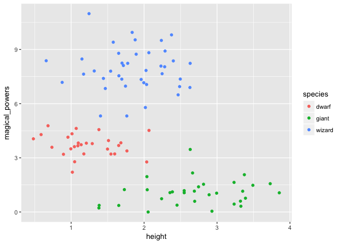
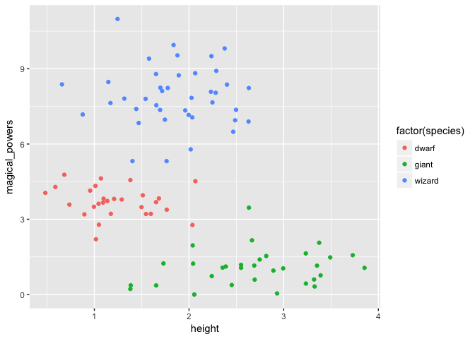

Unsupervised Learning
================

How to get set up for this workshop
-----------------------------------

### Our virtual space:

<http://backchannelchat.com/chat/parmw>

### Getting this document on your computer:

1.  Go to the GitHub repository here: <https://github.com/davidklaing/data_science_workshops>
2.  Click the green button on the right that says "Clone or download".
3.  Click "Download ZIP". (If you're proficient with git, feel free to clone the repository.)
4.  Create a folder on your computer to store your work, and store your ZIP file there.
5.  Double-click your ZIP file to unzip it and get all the code.

### Getting R and Rstudio

1.  Download and install R from here: <http://cran.stat.sfu.ca/>.
2.  Download and install RStudio Desktop (Open Source Edition) from here: <https://www.rstudio.com/products/rstudio/#Desktop>.

### Getting ready to play!

1.  In RStudio, open `unsupervised_learning.Rmd`, a file in `YOUR_FOLDER/data_science_workshops/unsupervised_learning/src/`. (That's this file!)
2.  In the code snippet below, remove the hashtags from both lines, and click the green "play" button on the right to install `dplyr` and `ggplot2`, the two packages you'll need for the workshop.

``` r
#install.packages("dplyr")
#install.packages("ggplot2")

library(dplyr)
```

    ## Warning: package 'dplyr' was built under R version 3.3.2

    ## 
    ## Attaching package: 'dplyr'

    ## The following objects are masked from 'package:stats':
    ## 
    ##     filter, lag

    ## The following objects are masked from 'package:base':
    ## 
    ##     intersect, setdiff, setequal, union

``` r
library(ggplot2)
```

    ## 
    ## Attaching package: 'ggplot2'

    ## The following object is masked from 'package:dplyr':
    ## 
    ##     vars

``` r
library(purrr)
```

    ## Warning: package 'purrr' was built under R version 3.3.2

### Having installation problems?

Option 1: Ask for help! We have volunteers who can help troubleshoot.

Option 2a: Find a partner and follow along together — most of the exercises can be done collaboratively. Your installation problem is almost certainly solvable — we just might not have time today.

Option 2b: Use [this datacamp light](https://cdn.datacamp.com/dcl/standalone-example.html) page to write and execute code in your browser. (A couple caveats: doesn't come with the titanic data, and might end up distracting you from the lesson. If this is your first time programming, I recommend option 2a.)

Rstudio review
--------------

Executing code: move your cursor to the line you want to execute, and hit CTRL+ENTER

``` r
print("hello!")
```

    ## [1] "hello!"

``` r
1+1
```

    ## [1] 2

Looking up documentation about a function or object: prepend the name of the object with a question mark, and execute that line.

``` r
print
```

    ## function (x, ...) 
    ## UseMethod("print")
    ## <bytecode: 0x7ff06afaadc0>
    ## <environment: namespace:base>

``` r
set.seed(3)

generate_height <- function(species) {
  if (species == "wizard") {
    max(0, rnorm(1, 1.8, 0.3) + rnorm(1, 0, 0.4))
  } else if (species == "dwarf") {
    max(0, rnorm(1, 1.2, 0.2) + rnorm(1, 0, 0.4))
  } else if (species == "giant") {
    max(0, rnorm(1, 2.6, 0.5) + rnorm(1, 0, 0.4))
  }
}

generate_magical_powers <- function(species) {
  if (species == "wizard") {
    max(0, rnorm(1, 8, 1.2))
  } else if (species == "dwarf") {
    max(0, rnorm(1, 3.5, 0.6))
  } else if (species == "giant") {
    max(0, rnorm(1, 1, 0.7))
  }
}

magical_data <- data_frame(
  species = sample(c("wizard", "dwarf", "giant"), 100, replace = TRUE)
) %>% 
  mutate(
    height = map_dbl(species, generate_height),
    magical_powers = map_dbl(species, generate_magical_powers)
  )
```

    ## Warning: package 'bindrcpp' was built under R version 3.3.2

``` r
unsupervised_magical_data <- magical_data %>% 
  select(height, magical_powers)

magical_data %>% 
  ggplot() +
  geom_point(
    aes(
      x = height,
      y = magical_powers,
      color = species
    )
  )
```



``` r
unsupervised_magical_data %>% 
  ggplot() +
  geom_point(
    aes(
      x = height,
      y = magical_powers
    )
  )
```


``` r
?kmeans

kmeans_result <- kmeans(select(magical_data, -species), 3)

kmeans_result$cluster
```

    ##   [1] 2 3 1 2 1 1 1 2 1 1 1 1 1 1 3 3 2 3 3 2 2 2 2 2 2 3 1 3 1 3 1 1 1 1 2
    ##  [36] 1 3 2 1 2 2 3 2 1 1 2 2 2 2 3 2 2 3 3 3 1 1 2 2 2 3 2 3 1 3 2 3 1 1 2
    ##  [71] 3 3 3 3 1 1 2 2 3 3 3 1 1 2 3 3 2 1 1 3 2 2 1 3 3 2 2 2 2 3

``` r
magical_data %>% 
  mutate(cluster = kmeans_result$cluster) %>% 
  ggplot() +
  geom_point(
    aes(
      x = height,
      y = magical_powers,
      color = factor(species)
    )
  )
```



Implement k-means!
==================

Steps:

1.  Choose k
2.  Initialize k random centroids (can choose points)
3.  Compute the distance from each point to the k centroids
4.  Assign each point to a group corresponding to its closest centroid
5.  Repeat steps 3 and 4 until the points no longer change groups.
